# CS370 Notes

## Chapter 1
- API: Application Programmer's Interface
  - functions, semantics, return values, library-dependent
  
- ABI: Application Binary Interface
  - register conventions, stack frame format, memory sections, OS and machine-dependent
  
- ISA: Instruction Set Architecture 
  - instruction types, data sizes, instruction format, addressing modes, machine-dependent
  
- Processor: performs computation
- Memory: hold info for processor
- Input and Output: processor uses to communicate to outside world 
  
- Number Representation
  - Value: amt of sth
  - Notation: how to express the value
  - Encoding: meaning of value
    
- Decimal -> Binary
  - Powers of Two
    - subtract greatest power of 2 that is <= number
  - Repeated Division
    - divide number by two, keep track of remainder, repeat until at zero
    
- Hexadecimal Notation (0-F)
  - Every number in hexa is 4 bits in binary

- Two's complement (2C)
  - Highest bit position = sign bit
  
 - Decimal to 2C
  - normal Decimal -> Binary
  - if negative, invert all bits, add +1
  
- Binary Operations
  - Add: like normal addition, but carry over in left-most column, then throw away
  - Negate (2C only): invert all bits -> +1
  - Subtract: same as subtraction or if 2C then negate subtrahend and add to addend
  - Shift 
    - Shift-right: shift bits to right, check sign bit and replicate
    - Shift-left: shift bits to left, replace right bits with 0
   
   - NOT: invert bits
   - AND: if both 1, then 1, else 0,  NAND is NOT(AND)
   - OR / NOR: if 1 of them is 1, then 1 else 0.  NOR is NOT(OR)
   
   - Sign-extend: based on sign bit and if 2C then fill with upper-bit position value 
   
---
## Chapter 2
    gcc -E <hll-src>

        -S <hll-src>

        -c <assmbly>

        <object file>

- PC indicate current exe instruction [incr by 4]
  - .data don't count

- RISC vs CISC 
  - RISC:
        - simple instrs, fixed bits, handful addressing modes, only operate on reg/immed vals
  - CISC:
        - operate on mem, variable length, many addressing modes

- Static Instr, from source code without run-time info
    - mnemomic, reg names, immed values, PC, addr of jump/branch
- Dynamic Instr, instr as they execute, with all info needed to determine outcome of prog

- Mips Format
    - R-type: 3 reg op / shift amt 
    - I-type: immed val
    - J-type: jump offset

- First instruction always at 0x00400000

- Two-Pass Assembler (scans code twice)
    - labels -> need to know target address

- Symbol Table
    - Label-Address pair

- program executable
    - file with all encoded instrs (seq order)
---
## Chapter 3
- Digital Logic Circuits 
    - voltage should be either 0 / 1

- Logically Complete
    - min set of logic funcs -> descr any other logic func
  
- logical functions 
    - use truth tables & logic equations
  
- Truth Table
    - all combinations on left, output on right
    - A B | AB

- Logic Eq Symbols
    - boolean 
        - black circle -> AND
        - '+' -> OR
        - '-' (bar on top) -> NOT
    
    diagrams
    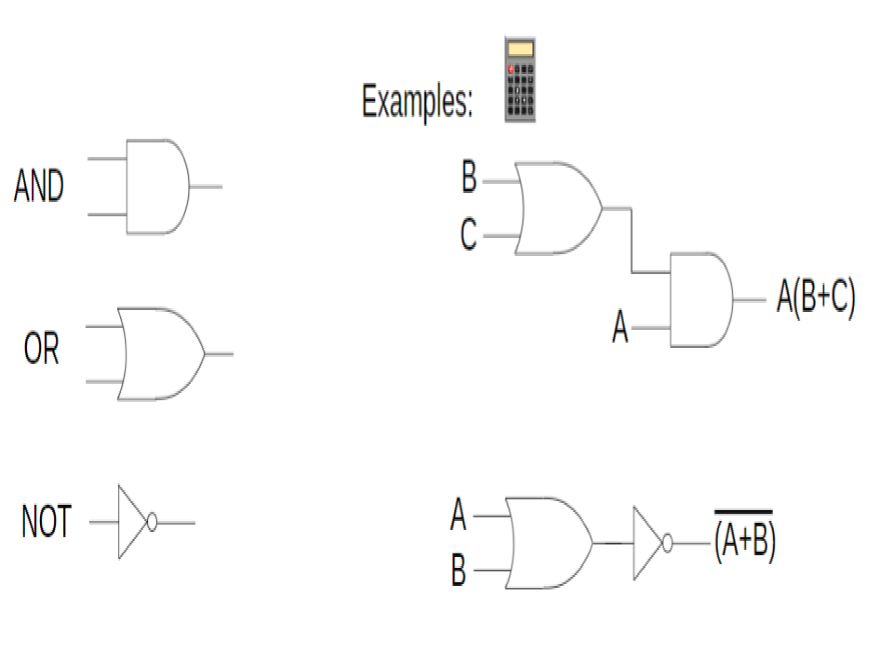

    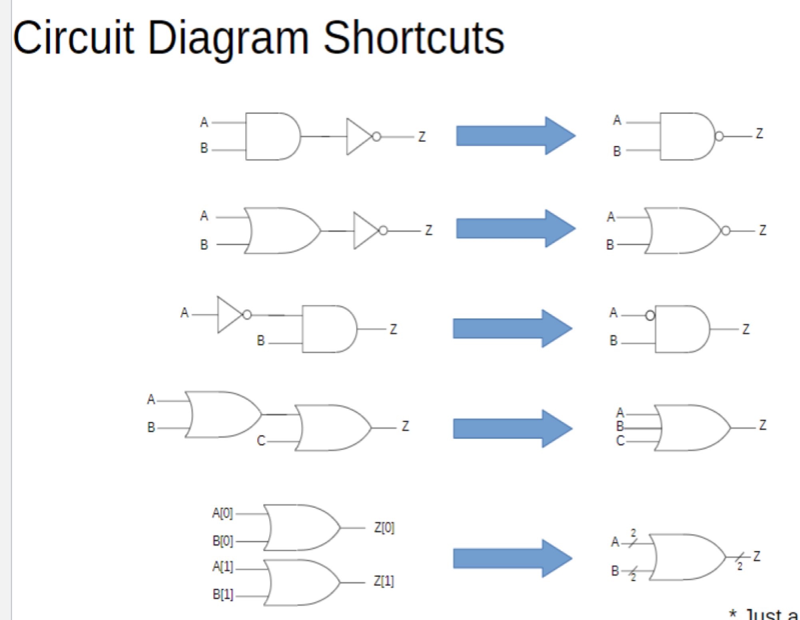

- Combinational logic: output depends on only curr set inputs

- Sequential logic: output depends on both inputs (& past)

- Sum Of Products
    - impl combinational logic 
    - AND gate to impl minterms with 1 in output
    
    - Minterms: 1 row of truth tables
    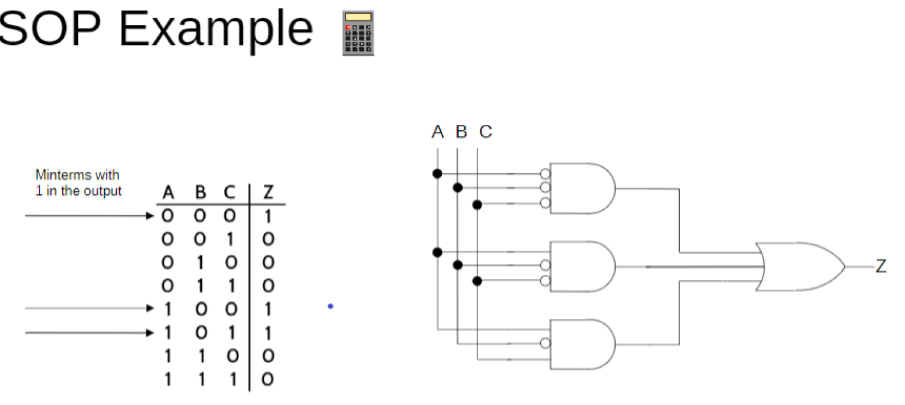

- Circuit performance
    - speed based on
        - critical-path delay: longest seq gates
        - wire delay: length of wire between gates
        - fan-out: avg # gates driven / gate
  
- Combinational Logic
    - Full Adder
        - input: A, B, Ci (prev carry bit)
        - Output: S (sum bit), Co (carry over)
        - S = A xor B xor Ci
        - Co = AB + BCi + ACi

    - Subtraction
        - negate subtrahend and add to addend 
        - use full adder

    - Ripple Carry Adder 
        - multiple full-adders that feed each other
            - most significant bit if carried over is overflow 
        - recursive  
      
      - Arithmetic Logic Unit 
          - ALU
          - select which function you want
          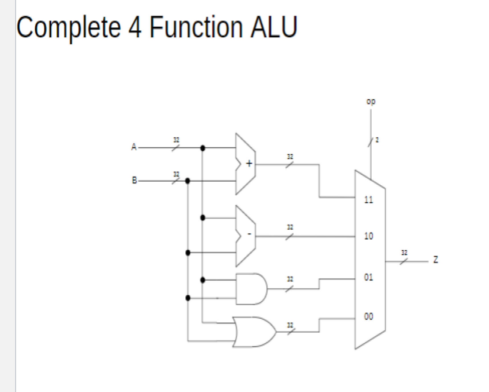

      - Multiplexer 
          - Mux, data input values -> single output "select"
          - always a single output
          - based on input bits to select operation
          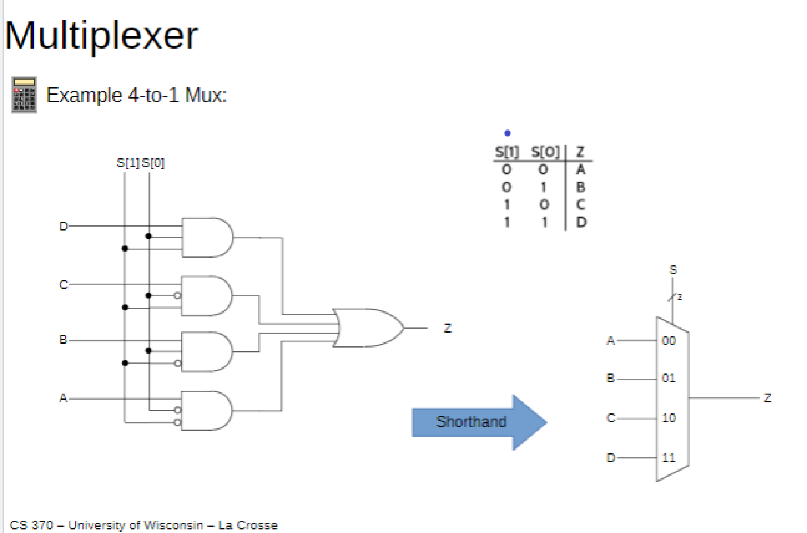

  - Sequential Logic
      - RS Latch (most basic)
          - R 
          - S 
          - Q
          - Q (bar)
          - Create truth table for logic gates
                1)  use R and S values
                2) find Q and bar Q value
                3) save those values for next inputs
                4) use new input values and see if Q and bar Q remain the same.
                    - if Q and bar Q are the same there is a problem and don't use that 
      - Gated SR Latch
          - S, E, R
          - E if 1, enables latch Q
          - but there is a race condition 
      - Gated D Latch
          - Remove R, rename S to D, add a not gate to D 
          - 1 inputed gated latch
          - Q will reflect D as long as W is high
          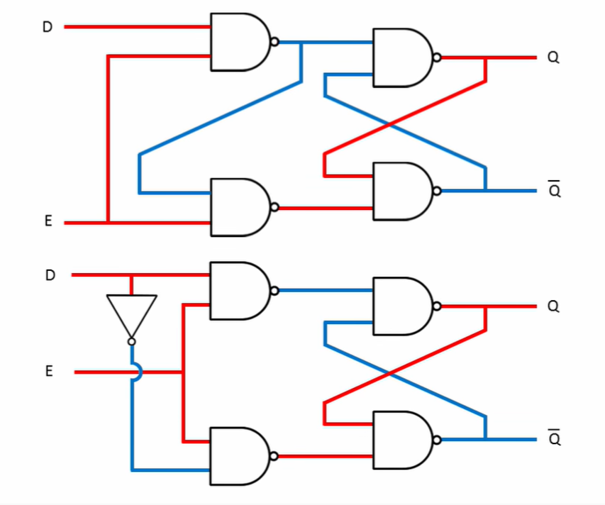
      
      - D Flip-Flop
          - avoids races
          - signal transition twice
              - h -> l -> h
              - l -> h -> l
          - edge triggered, final Q only change on rising/falling edge
          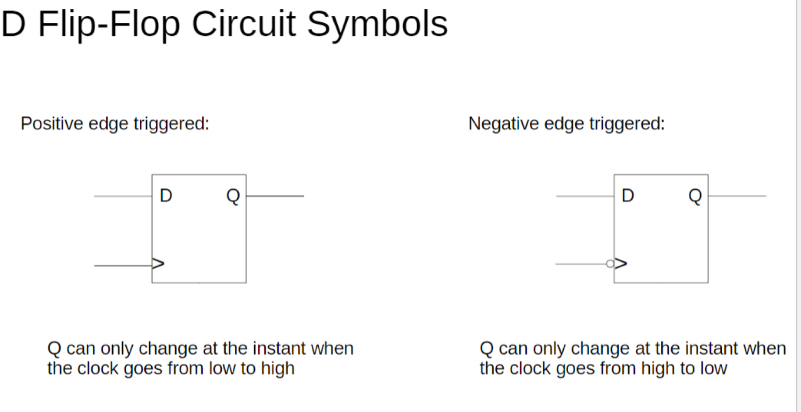
          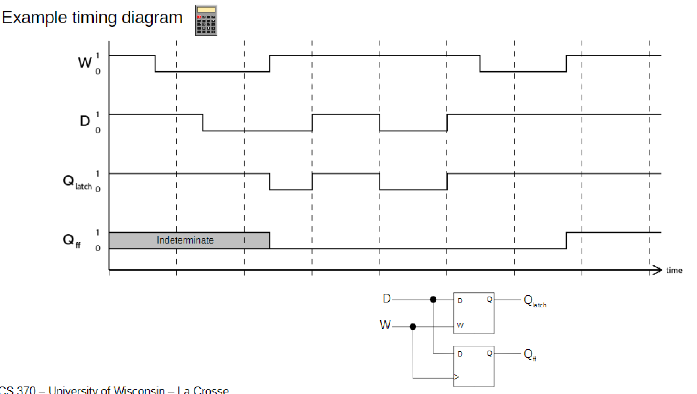
          - if aperiodic, need to add clock input to coordinate movement 
      - Clock
          - 1 bit signal that alternates as chip is powered 
          - heartbeat (most important)
          - cycle: complete transition from h->l->h
          - period (T) in seconds for 1 cycle
          - frequencey (f): # cycles / second, Hertz (Hz, 1/s)
          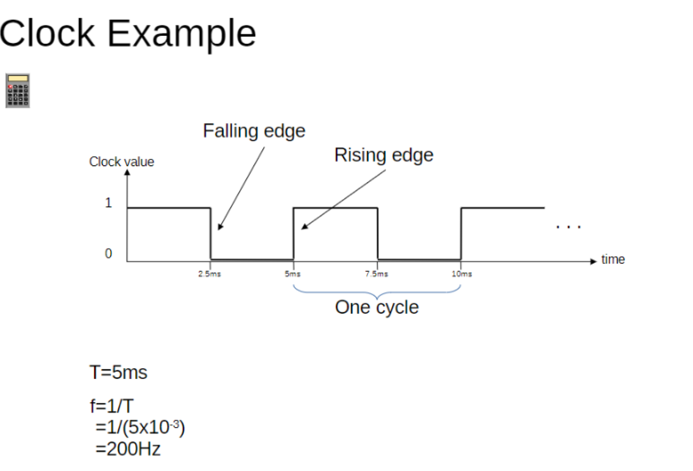
      - Multibit Register
          - register: multiple D flip-flops, all sharing same clock signal
          - saves multiple bits 
      - Random Access Memory (RAM)
          - rows: location / words
          - cols: bits for each word
          - each word: iden by addr
          - needs: one-hot decoder
          - read & write operations
          - inputs: 
              - (A) Address: (iden 1 loc)
                  - **bits: log2(# locations)**
              - (W) Write-enable: R / W
                  - **bits: 1**
              - (D) Data-in: 
                  - if W, D-input should have value
                  - else ignore
                  - **bits: by wordsize**
          - output
              - Data-out (D)
                  - if R, output prev saved data for spec loc
                  - **bits: by wordsize**
          - Write
              - set addr input to bin loc to write to
              - set input D value to write
              - set write-enable (W)to 1
               - **loc must be written before read, otherwise indeterminate**
          - Read
              - set addr input to loc to read
              - set write enable to 0
              - output Q read prev saved data val
          - 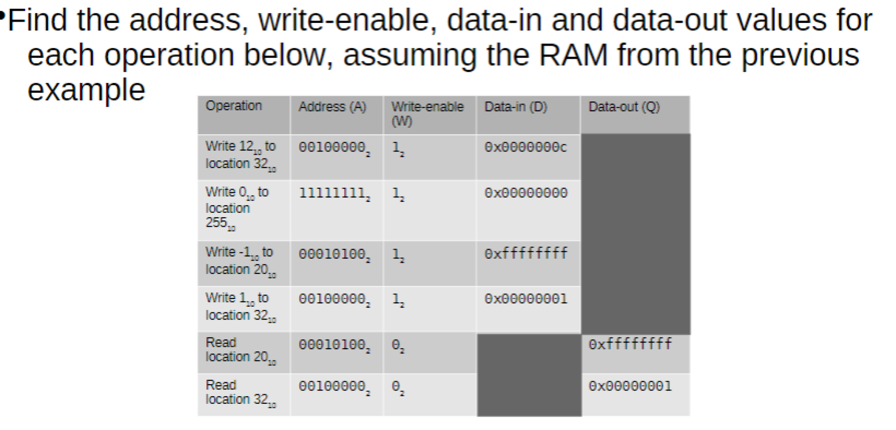
          - 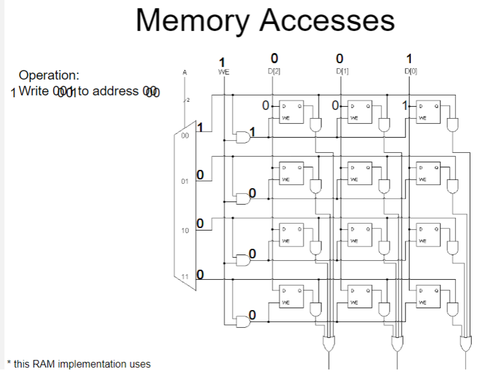
          - One-Hot Decoder (Row Decoder)
              - n bits, addr
              - 2^n output (wordlines)
              - 1 output of 1, others will be 0
          - RAM with 32-bit words, total capacity of 1024 bytes, how many locations will RAM have?
          - 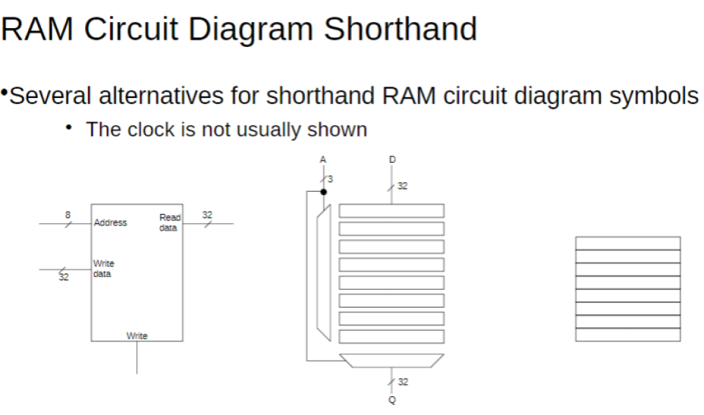

        - Read/Write Ports
            - Read port
                - addr input & data-out output
            - Write port
                - addr input & data-in input (write enable)
            
            - allows simultaneous reads/write in cylce with ports
                - addr totally diff
                - new addr input 
                      - **one-hot decode** for write ports
                      - **muxes** for read ports
                      - no additional flip-flops
            - 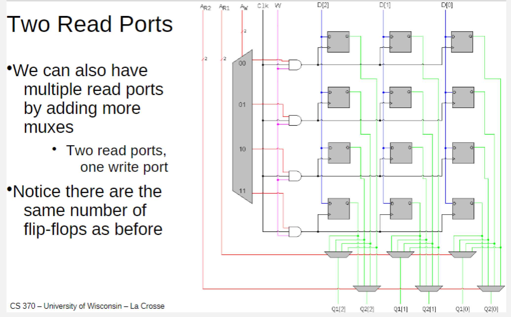
--- 
## Chapter 4 
- Single Cycle Mips Processor
- Processor Design
    - run prog, OS copy instr -> main mem loc
        - uses **loader** to do this
- Executing Instructions (High-level)
    - **Fetch** 
        - read op from main mem 
        - instr addr held in reg PC
    - **Decode**
        - grab opcode/funct 
    - **Register Read**
        - read register file RAM to get reg values
    - **Execute**
        - arithemetic: set select op input of ALU
        - load: **read mem**, addr calc (add calc)
        - store: **write mem**, need to do addr calc
        - branch: check cond then set PC
        - jump: change PC
                
    - **Write Back** 
        - Dest reg operands, vals written
            - load, arithmetic, rt/rd
        - PC written
            - if branc / jump, PC written with computed next PC
            - if load/store/arithemtic, PC writtenw ith PC+4
    - **Change PC to new PC**
    - 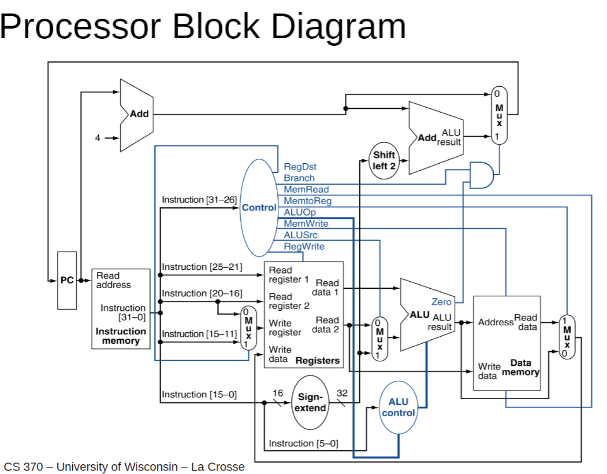
    - Control Path vs Data Path
        - Control path: changing select bits of muxes, write-enable bits for RAM, op selection bits for ALU 
            - it's in blue from the picture
        - Data path: 
            - data and addr used by prog
            - it's in black 

- Executing Instructions (Low Level)
    - **Instruction Fetch**
        - use addr in PC, 32 bit addr
        - add 4 to PC to get next seq addr
        - must use flip-flops since feedback of prev computed PC value
        - 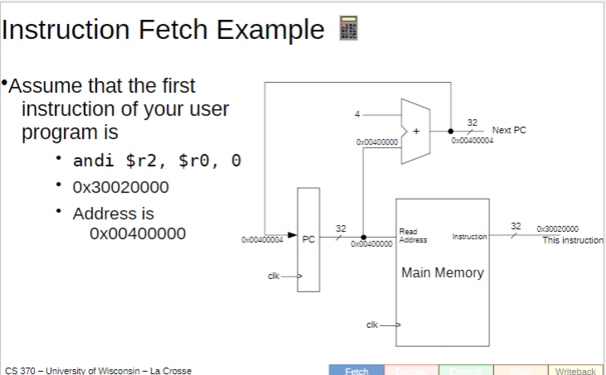
    - **Decode and Register Read**
        - read what type of instr was read
        - read any source register ops

        - Decoding
            - split up bits from the instruction
        - Register read
            - register file
        
        - Immediate operands
            - sign extend immediate field
    - **Execute**
        - ALUSrc
            - select input to mux
        - ALU Control
            -  ALU depends on instr
                - opcode and funct
    - Accessing Memory
        - store instr: sb, sh, sw -> rs used to access reg file
    - Memory
        - 2^32 locations
        - each location = 1 byte
    
    - **Writeback**
        - arith and loads write back to reg file 
    - Branch Computation
        - reg 1 - reg 2 == 0 ? 
            - PC not PC+4 if 
                - beq, and ALU 0
                - bne, and ALU !0
                - PC + 4  + (SignExtImm <<2 )
    - Jump
        - jump=1 for j & jal
--- 
## Chapter 5
- Processor Performance Measurement
- Metrics
    - Total Execution Time
        - *Exe Time B / Exe Time A = X**
            - **speed-up** is x
            -  A is X times faster than B
    - Cycles per Instr
        - lower is better
        - **CPI = total cycles to exe / total # instructions**
    
    - Execution Time = num cycles * clock period 
        - num cycles 
            - num # exe * num clock cycles per instr
    - Frequency = 1 / clock period
    - Energy: capacity to do work, Joules, battery life
    - Power: rate of consuming energy, Joules/second (Watts)
        - more perf = higher power
    - Energy more meaningful to compare
    - Instruction per cycle
        - IPC = 1 / CPI
    - *Instructions per Second (IPS)**
        - takes frequency into account
    - IPS / W 
        - performance and power into single metric
- Benchmark
    - standard utilities
    - standarized 
    - **Phase**: small subset of benchmark execution
- Perf Improvements
    - longest circuit path / critical path
    - single-cycle processor limited by clock freq
    - main mem extremely slow
- Make sure ISA satisfied
    - look for patterns, add circuits to make efficient

## Chapter 7 
- **Caches**
- Size of RAM increases latency
    - larger RAM, incr wire lengths, larger row decoders
- Main Mem (hundreds of nanoseconds)
    - Needs: Large, cheap, dense
        - density through **bitcells**
            - flip-flop =  atleast 6 transitors
            - mem bitcell = 1 transitor & 1 capacitor (Dynamic RAM)
- problem: pipeline clock down to meet 1 cylce mem access
    - pipeline clock period = 1ns
    - mem latency = 300ns
    - multiple cycles -> stall instructions & insert bubbles -> lose performance of pipelining
    - main mem usually not on same chip -> adds latency

- Memory access patterns
    - working set
        - prog only uses small subset of main mem at any given time 
    - Spatial locality
        - access nearby locations of access mem loc (like arrays)
    - temporal locality
        - acess mem loc -> access again  (incrment var)

- Cache (due to working set small, temporal & spatial common)
    - mem vals -> small RAMs with shorter latencies
        - best if keep working set in RAMS accessed in 1 cycle
- mem hierarchy 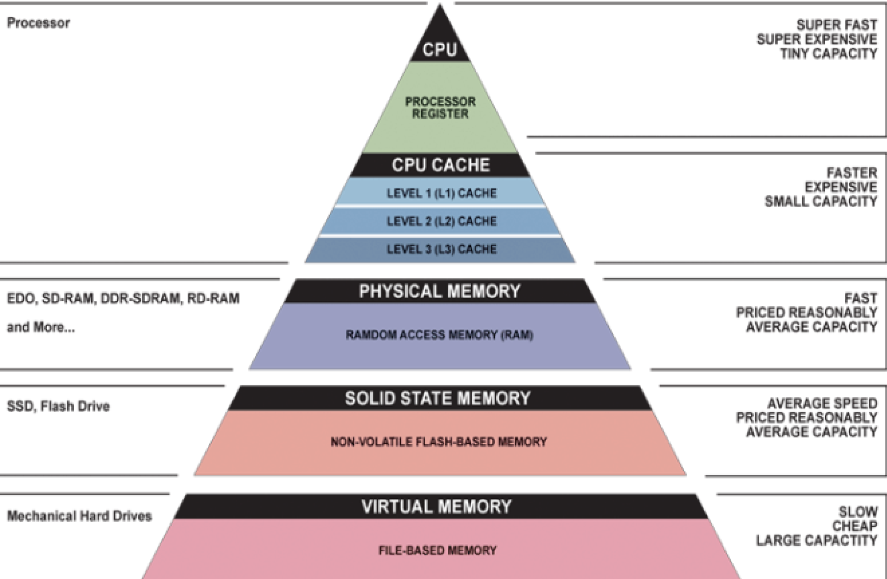
    - higher up is smaller mem but faster
- Cache Hierarchy
    - between process & main mem
    - L1: small RAMS for accesses in 1 processor cycle
        - split instruction cache & data cache 
    - L2: larger, accessed in 5-6 processor cycle
        - both instruction & data
    - L3: 20-30 processor cycles
        - multi-core ships share
    - L4

- Mem Hierarchy Management
    - processor regs: explicity ref
        - ISA
    - mem: loc based on address 
        - mem loc ISA, mem regions ABI
    - caches: by cache controller
        - invisible
        - influence program perf by changing algorithm to work in working set within size of caches
    - Disk drive: os write mem vals to hard drive (less mem < max possible addr range)

- Basic Cache Operation
    - subset of main mem
        - keep track of addr currently being held
    - referenced (read / write)
        - hit if can read / hold write data
        - miss, else
    - if no cache contains, then DRAM must have the address
    - only has values when process req mem locs

- Cache specific metrics
    - hit rate: % hit
    - hit time: # cycles to determine if addr within cache
    - miss rate:  1- hit rate
    - miss penalty: # cycles to service mem access (assumming next level has addr)
        - miss penalty >> hit time 

- Alignment
    - mem access aligned based on size of access
        - important to check alignment 
        - lbu, sb -> byte -> any 32-bit addr
        - lhu, sh -> 2 byte -> addr must end with 0(2)
        - lw, sw -> 4 byte -> addr must end with 00(2)
    - unaliged would increse checking addresses at diff rows
        - & changes numbering order of the column 
    -  0 1 2 3 4 5 6 7 8...
        - 3 2 1 0
        - 7 6 5 4
            - word address: 0 1 1 0 --> 0 1 = row, 1 0 = col

- Cache Organization
    - cache block / cache line: min amt mem held in cache
        - seq locations, bytes retrieved aligned to cache block
        - only read/write within block
    - large blocks benefit if lots of spatial locatlity 
    - **total capacity (bytes)** = # blocks x block size
        - k = 2^10
        - M = 2^20
        - G = 2^30
        - T = 2^40
    - Need to mapping of addr & avail cache space
        - 2D matrix of cache blocks 
            - cache **sets**
            - cache **ways**
        - 3 types of mappings
            - **Direct-mapped**: only 1 way, addr map to 1 set
            - **n-way set associative**: n ways, addr map to any way within set
            - **fully associative**: 1 set, addr map to any way within set
    - **block offset**: lowest bits of addr -> identify which bytes
        - 3 bits --> 8 byte cache block
- Powers of Twos
    - b = bits
        - bytes -> bits, multiply by 8
    - B = bytes
        - bits -> bytes, div by 8
    
    - 1 cache block, 8 byte block 
- Mem acess if aligned properly
    - 32 byte cache block
        - lw: 0x00405518, must be multiple of 4
        - lhu: 0x1000f832, must be multiple of 2
        - sw: 0x7fff20e5, not aligned, hardware exception
        - sw: 0x0050a7f4
    - which bytes will bve accessed
        - 1) 110000, col 24 -> 24, 25, 26, 27 (since lw)
        - 2) 10010, col 18 -> 18, 19 (lhu)
        - 4) 10100, col 20, 21, 22, 23 (sw)
- Direct-mapped
    - 1D array of cache blocks
    - block offset (select byte in block) -> **index** (select block)
        - Addr [31 | index | offset 0]
    - map to only 1 specific set

    - 32 byte block 
        - how many bits in each block? 32 bytes x 8 bits / byte = 256 bits
        - bits for addr offset = log2(32) = 5
    - 128 sets
        - bits for index = log2(128) = 7

    - total capacity: block size x # sets

    - **tag**: upper-most bits of addr are unique in set
        - only save upper-most bits to compare for hits
    - **important**
        - offset bits = log2(block size) [column of set]
        - index bits = log2(# sets) [select row of set]
        - tag = 32 - offest bits - index bits
        - [tag | index | offset]
    - 16 byte block & 16 sets
        - bits for tag: 
        - total capacity: 16 x 16 

    - add **valid** bit to mark if cache block adn tag has been previously filled
        - before running prog -> zero out valid bits
        - while running -> new cache block valid bit = 1's until next prog starts
    
    - hit if valid & tags match
    - **Allocation policy**: when bring cache block into cache
        - assumming missed in cache
        - reads
            - always bring cache block into cache
                - Load instructions from data cache in MEM stage
                - all instruction reads from instruction mem in IF stage
        - Writes
            - store write to mem hier during MEM
            - **allocated on write**: store misses, bock of data -> cache, write to necessary bytes
            - **write no allocate**: store misses, write data to mem, don't bring block of data into cache
    - bring block -> cache, but cache has valid block at given set
        - **replace** old block
    - **Write policy**
        1) **write through**, redundantly write val to next lvl in mem hier
            - Accessing next level incurs cycle penalty
                - store instruction -> **write buffer**, copy value into -> autonomously written to next without any intervention -> latency hidden as long as it doesn't fill
        2) **Write back**, wait to write to next lvl until block is replaced
            - lots of writes before to main mem -> write to higher lvl of cache & write to next lvl when block is replaced
                - if multiple same addr -> only most recent is written
            - **write back cache set**
                - data block (payload), tag, valid bit, dirty bit
                    - dirty bit 0 when cache block alloc
                    - dirty bit 1 when any bytes were written in block
                    - if dirty bit 1 when block replaced, write block to next lvl
- Misses
    - 3 classifications
        - cold miss / compulsory miss: addr never been used prev
        - conflict miss: addr used but replaced by another block mapped to same set
        - capacity miss: working set of prog > avail cache
    - multi-processor miss
        - coherence miss: proc A writes to addr -> invalidate cache block -> proc B miss cache next time access addr
- n-way set associative
    - 16 byte block (offset is 4 bits)
    - 256 sets (index is 8 bits)
    - if both addr have same index bit, direct mapp miss every acess
        - each set has multiple blocks 
        - given addr only ever occur 1 way of a single set
            - make sure tag/valid bits match for 1 way 
    - has all of direct-mapp policies
    - **Replacement Policy**
        - FIFO (first in, first out)
        - LRU (least recently used)
        - randomly select way to replace
    - **capacity** = (byte block) x (sets) x  (n way set associative)
        - offset = 6 bits of addr
        - inedx = 8 bits of addr
- Fully Associative
    - 1 set, # ways = # blocks
    - gets rid of all conflict misses
    - lots of tag comparisons, cycle time penalty
    - used for other circuits, content addressable memories
    - no need for index bit
    - **total capacity** = (# blocks) x (block size)
    - replacement policy is critical, determines hit rate 
- Cache Parameters
    - options: block size, sets, associativity, alloc/write/replacement policy
    - fair comparison
        - equal cache capacity: access latency remain constant
        - same access pattern: eliminate diff bewtween programs
    - lower miss rate always better if access latency is same
    - incr block size
        - good if lots of spatial locality
        - fixed capacity & associativity -> decr # sets -> incr conflict misses
    - incr associativity
        - adding ways incr hit rate by reducing # conflict misses
        - for constant capacity & block size, reduce # sets
    - alloc policy
        - write-allocate is benefiicial if later accesses occur to same block
        - alloc blocks on writes mean replace blocks that might be accessed
    - write policy
        - only determine when write values propagated to next level in cache hier
        - write buffer -> dont need to wait to be written to next level
        - write buffer may need to be checked if cache miss occurs
    - conclusion
        - hit rate & perf depends on cache params & mem access pattern

## Interrupts & Exceptions
- Interrupts: signals from events outside of processor
- Exceptions: events within processor
- offending instruction: instruction causes exception
- handling
    - stop prog, track PC
    - set PC -> OS
    - OS handle exception
    - if recover, OS restart at offending instruction
        - else: prog killed & error message displayed
- Pipeline
    - precise exceptions: all instructions prior to offending instruct are available (written to reg file & mem)
    - imprecise exceptions: reg file & mem may have incomplete results or instrs after offending instr
- MIPS Mem Layout
    - kernel: instrs & data needed by OS
    - stack: runtime stack, args, local vars
    - heap: dynamic alloc mem
    - static data: glob vars
    - text: prog instructions
    - reserved
- Exception PC (EPC)
    - special purpose reg added to execute stage
    - EX stage detects --> copies PC to EPC
- Cause Register (EX stage)
    - exception occur -> reg set with exception code
    - 31 branch delay, 15-8 pending interupts, 6-2 exception code
- Exception Handling Hardware
    - referred as: **co-processor 0**
    - **co-processor 1** handles floats
- Result val of Offending Inst
    - could overwrite useful info 
        - add $t0, $s1, $t0
        - overflow
    - OS may want old val of $t0 for error reporting
- ISA support 
    - mfc0 instr, to access cause reg
        - copy cause reg to general purpose reg
    - mfc0, r-type, R[rd] = CR[rs], Opcode/funct: 0x10/0x00
    - if recoverable, user prog resume when OS exe "eret" instr
        - eret, r-type, PC = EPC, Opcode/funct:0x10/0x18
    - OS does not overwrite any user prog reg vals
        - OS uses $k0 & $k1 (gen purpose reg file)

## Virtual Memory
- motivation
    - pros all have same mem map
    - os supps running multiple progs simul
    - virtual mem
        - extend mem hierarchy to lager (slower) hard disks
        - mem values to be shared by 2 progs
- Virtual mem
    - mem slow (need cache), hard disks much slower (100,000x)
    - **virtual addresses** addresses used by prog
        - 0x00000000 - 0x7fffffff
    - **physical addresses** addr to access main mem
- Mem Value Placement
    - **pages**: contig chunks of V-mem
        - place anywhere in main mem or hard disk 
- Addr Translation
    - translation of virtual addr --> physical addr
        - page table, held mem
        - each prog has page table
    - virtual addr = virtual page number | page offset
        - virtual page number = 32 - log2 (page size)
        - page offset = log2 (page size)
    - physical addr = physical page number | page offset
        - physical page number = log2 (mem size) - log2 (page size)
        - page offset = same as virtual addr page offset
- Page Table    
    - array in mem
    - Page Table Entry (PTE): each entry in page table
    - meta data
        - valid bit, dirty bit, access protection bits, replacement bits
    - Page Table Register: starting addr of page table
    - each prog has own page table
- valid bit 
    - if 1, page in physical mem
    - 0, page on hard disk
- Simplified Virtual Memory
    - prog attempts access mem --> virtual addr & raise signal to MMU
    - find PTE, check valid bit
        - if invalid, phyiscal on hard disk, **page fault**
            - puts page into physical mem, validate PTE
    - physical page num + page offset concatenated 
- Implications of Virtual Memory
    - page table consumes physical mem
    - 2 physical mem access for each access done by processor
        - page table entry, actual read/write
    - latency on hard disk is millions of cycles
        - locality important
- Improving Virtual Mem Performance
    - translation (virtual to physical) could take lots of cycles
    - caches improv access for instrs & data accesses
    - **Translation Look-aside Buffers** (TLBs): "cache" translations  
        - payload is physical page number
        - no need to pollute reg data cache
        - tlb small to maintain single cycle translation
        - if TLB miss, need to access page table for translation
        - must access page table to fill TLB
        - structure
            - valid|dirty|ref|tag|physical page addr
- Coexisting with caches
    - (Caches) no distinction between physical and virtual addr
    - accessing caches 
        - Physically addressed cache
        - Virtually addressed cache
        - Virtually Indexed Physically Tagged cache
            - page offset bits from V-addr but tagged with pyhsical page number
                - safe, page offset bits same 
- Implications for cache types
    - physically indxed physically tagged
        - addr translation before accessing cache, add cache latency
    - Virtually indxed, virtually tagged
        - conflicts when cache running multiple programs
    - Virtually indexed, physically tagged
        - addr translation parallel with indexing into cache
            - translation done, tags compared with cache block read out of cache
        - restriction on shape of cache
            - index & offset bits to access cache must be same as page offset bits
- Virtual Memory Summary
<table>
    <thead>
        <tr>
            <th>TLB</th>
            <th>Page Table</th>
            <th>Cache</th>
            <th>Possible?</th>
            <th>Events</th>
        </tr>
    </thead>
    <tbody>
        <tr>
            <td>Hit</td>
            <td>Hit</td>
            <td>Hit</td>
            <td>Yes</td>
            <td>This is what we want to happen as much as possible.</td>
        </tr>
         <tr>
            <td>Hit</td>
            <td>Hit</td>
            <td>Miss</td>
            <td>Yes</td>
            <td>Page is available in memory, but missed in the cache. The page table does not need to be checked, since the TLB hit.</td>
        </tr>
         <tr>
            <td>Miss</td>
            <td>Hit</td>
            <td>HIt</td>
            <td>Yes</td>
            <td>TLB missed. If cache is physically addressed, then a translation must take place before accessing the cache.</td>
        </tr>
         <tr>
            <td>Miss</td>
            <td>Hit</td>
            <td>Miss</td>
            <td>Yes</td>
            <td>Address translation must occur, then the cache can be filled (allocation or replacement).</td>
        </tr>
         <tr>
            <td>Miss</td>
            <td>Miss</td>
            <td>Miss</td>
            <td>Yes</td>
            <td>A page fault occurs, the operating system must read the page from the hard disk.</td>
        </tr>
         <tr>
            <td>Hit</td>
            <td>Miss</td>
            <td>Hit/Miss</td>
            <td>No</td>
            <td>The TLB can hit only if the page table has a mapping for the virtual to physical address.</td>
        </tr>
         <tr>
            <td>Miss</td>
            <td>Miss</td>
            <td>Hit</td>
            <td>No</td>
            <td>Data is not allowed into the cache if the page is not in memory.</td>
        </tr>
    </tbody>
</table>
- Example
    - page size: 4k bytes
    - page table entry size: 4 bytes
    - physical mem capaicty: 2G bytes
    - (virtual page number * 4) + page table register 
        - valid bit is uppermost physical addr (check that if page fault)
        - lower bit positions of physical page number: page numbers
    - physical addr: physical page number concat page offset
    - answer
        - page offset bits: 12 
        - num bits for v-page num: 20
        - num bits for physical page number: 19
        <table>
            <thead>
                <tr>
                    <th>Virtual Addr</th>
                    <th>Virtual Page NUmber</th>
                    <th>Page offset</th>
                    <th>physical page number</th>
                    <th>Physical addr</th>
                    <th>page fault</th>
                </tr>
            </thead>
            <tbody>
                <tr>
                    <td>0x1008f458</td>
                    <td>0x1008f</td>
                    <td>0x458</td>
                    <td>0x253f1</td>
                    <td>0x253f1438</td>
                    <td>no</td>
                </tr>
            </tbody>
        </table>

## Performance Analysis
- Execution time = # instr x CPI (cycle/instr) x clock period
- instrs determined by assembly programmer / compiler
- clock period by architect
    - how many stages in pipeline
    - how digital logic circuits impl 
- num cylces per instr impro by arhcitect & programmer
- CPI: avg over all instrs
- analytical models: eqs used to est perofrmance
- simulator: mimic behavior of sys & accumlates perf metrics
- CPI
    - unpipelined processor
        - each instr complete before next
        - CPI = 1
    - pipelined with 1 cycle mem accesses
        - taken branches -> buble
        - Load instr read -> buble
        - add extra cycle 
- improv CPI
    - instrs to fill load-use bubble
    - avoid taken branches
- Realistic CPI
    - mem access latency is single cycle when addr hit L1 cache
    - take misses into account
        - if write buffer, don't wait to store miss (unelss filled)
        - if load, check cache & buffer
- CPI
    - CPI =  num cycles / num instrs
    - unpipelined processor with perfect mem hierarchy = num cycles = num instrs
    - pipelined, no hzards, perfect mem = num cycles = num instrs + (pipeline - 1)
    - Pipelined, program does have hazards, and perfect memory hierarchy: #cycles = instructions + (pipline depth – 1) + (#instructions)(%taken-branches) + (#instructions)(%load-use)
    - Pipelined, with 1 level of hierarchy and memory: # cycles = # instructions + (pipeline depth – 1) + (#instructions)(%taken-branches) + (#instructions)(%(hit && load-use)) + (#instructions)(%misses)(miss penalty)
    - Pipelined, with 2 levels of hierarchy and memory: # cycles = # instructions + (pipeline depth – 1) + (#instructions)(%taken-branches) +(#instructions)(%(hit && load-use)) + (#instructions)(%missesL1)(miss penaltyL1) + (#instructions)(%missesL2)(miss penaltyL2)
- Analytical Models 
    - closed-form solution
    - help us focus which terms for potential improvments
- Performance 
    - speed-up = Tbase / Tenhanced
    - multiply instructions account for 10% of prog
    - 1 - f time that cannot be improved
    - s is speed-up of f 
- Amdahls Law
    - overall speed-up limited by part of sys that is not improved
    - speed-up = Tbase / Tenhanced
        - Tbase/Tbase(1-f) + Tbase f/s
        - 1/(1-f) + f/s
    - ex
        - baseline: 6
        - enhance 5
        - 10% benchmark is mulytiply 
        - 1 / (1 - 0.1) + 0.1/1.2

    

        
