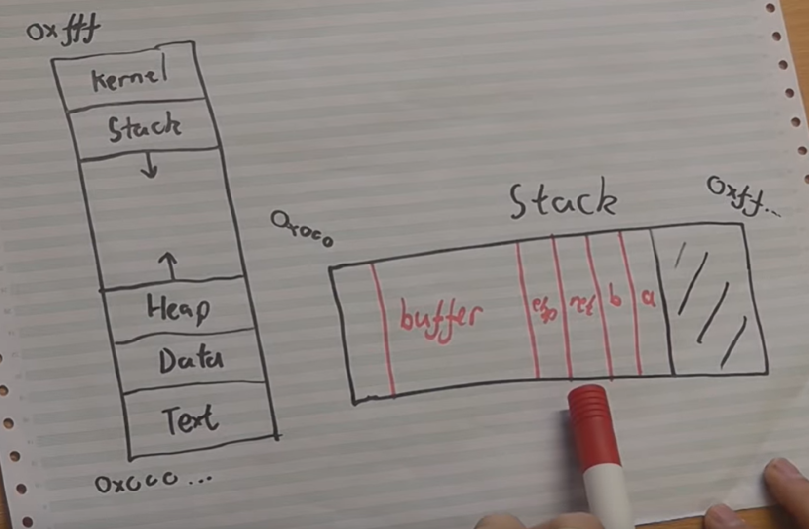
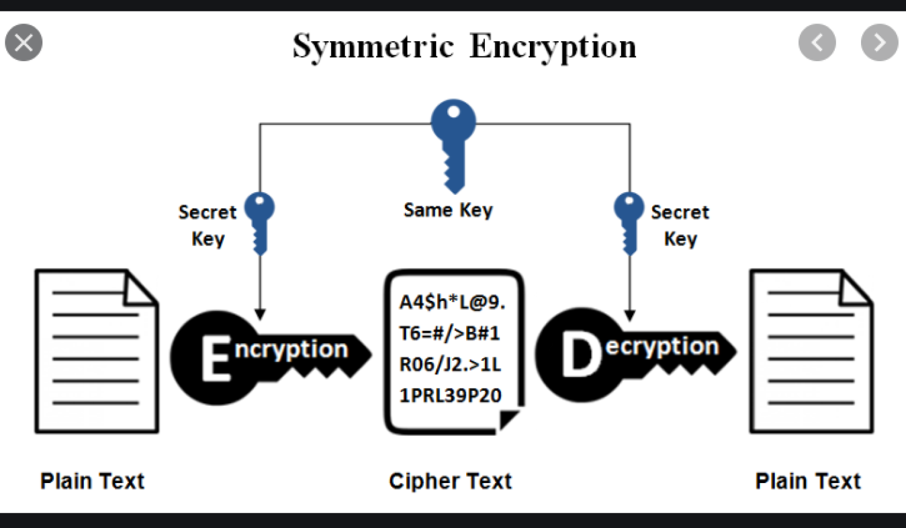
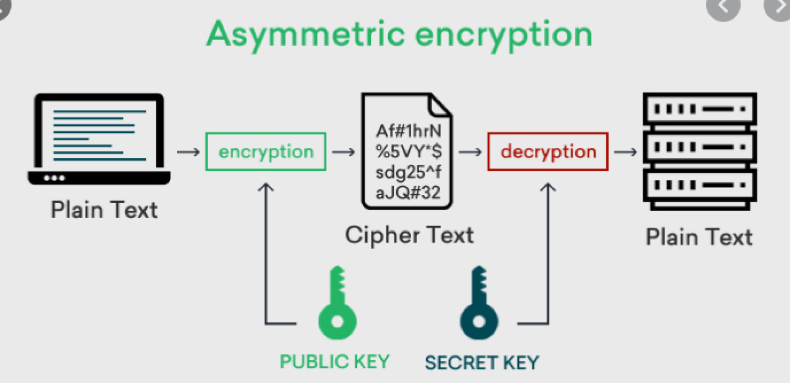
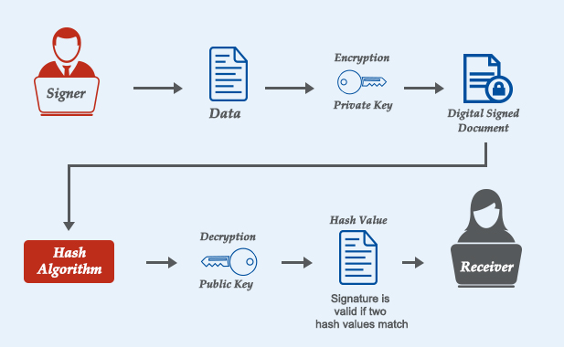

# Midterm Review 
## Terminology
- **confidentiality**
  - proctect access and disclosure of info from unauthorized parties
- **integrity**
  - protect improper edit/destruction, ensures authenticity
- **availability**
  - timely and reliable acessibility to and use of info
- **Authentication**
  - identifying who you are
- **Access Control** 
  - method gaurenteeing  of people who say they are will have approparitate access to info

## Software and OS Security
- SLDC with addressing security
    - Phase 1: Formation
        - just understand the possibilities scopes of vulnerabilities
    - Phase 2: Req/planning
        - non reqs and security mechanisms and policies to use
    - Phase 3: analysis
        - analyze potential vulnerability, where and when they could propagate
    - Phase 3: Design
        - use secure designs that work,be mindful of weak points
    - Phase 4: Impl
        - defensive programming, correct algo impl
    - Phase 5: Testing
        - apply software that tests program of security issues (input fuzzing)
    - Phase 6: Deployment
        - maintain hooks and gracefully handle errors
    - Phase 7: maintence
        - hooks and logging
- Unix command to see user permissions
    - **ls -l fileName**
        - "- --- --- ---"
        - file type, user, group, execute
        - read, write, execute (rwx)
- Basic principles of Bell La Padulla Model
    - formal model of access control
    - security classes in which assigned to
        - subject has security clearance
        - object has security classification
    - READ, APPEND, WRITE, EXECUTE
    - multilevel security
        - no read up (read obj <= security level)
        - no write down (write obj >= security level)
- Race condition occurs when multiple processes access & manip same data concurrently & outcome depends on order of access
    - if priveledge program, can run parallel process, intention to change behavior of program

    -  alter, manipulate, or steal data, make changes to privileges, insert malicious code, unleash a denial of service (DoS) attack, and deactivate security controls 

### Buffer Overflow
- Desc & draw pic of buffer overflow attack
    -  
    ```c
    void hello(char *tag) {
      char inp[16];
      printf("Enter value for %s: ", tag);
      gets(inp);
      printf("Hello your %s is%s\n", tag, inp);
    }
    ```
  - 
  - Stack will store the function calls including locals along with it's return address.
  - When the input is over the buffer, the information will overwrite the current memory stored, so if the return address is completely overwritten
  - Then when the function ends, it will try to return using that memory addr at return memory section, but if we add a payload  then we can make go to payload.
  - the payload can be a small program that can run malicious code
  - However since memory moves around, you need some no op code (move on code) values so  to eventually hit your target payload


  - Mitigations
    - Compile Time
        - Safe coding techniques: audit and inspect any unsafe code
        - language extension, safe libs
        - stack protection: check entry and exit code for corrupt 
          - (random canary / Return Address Defender (RAD))
    - Run time
        -  executbale addr space protection (use virtual mem for some non-executable)
        -  Addr space randomization 
            - (manipulate key data structures / heap buffers / lib func locas)
        -  Guard pages between critical regions -> if access then abort process

- SQL Injection'
    - asking for input, usually username / password, and DB is using an SQL based datbase
    - Input an SQL statement into the input text box 
    - Then the input will run on your DB
    ```SQL
    SELECT * FROM Users WHERE UserId = 105 OR 1=1;
    ```

## Authentication
- Goal: verifying an identity claimed 
- Ways of Authenticating
    - knowledge
        - password
            - pro: easy to change, impl, reset, convenient
            - con: easy to hack, could choose bad pw
    - possession (token)
        - e card / token
            - pro: stronger than pw, multiple types of data stroed
            - con: can lose & reader for device (expensive)
    - is (static biometrics)
        - finger print 
            - Pro: easy to remember, more secure than pw, unique
            - con: hard to change if hacked, acurracy not great
    - does (dynamic biometrics)
        - monitor behavior (way you type)
            - pro: can be very accurate 
            - con: extremely complex 
- How are passwords stored in linux?
    - There is a password file in linux in which passwords are stored in.
    - user ID, salt, hash code.
    - password + salt -> hash code compared with hashed password that's stored.

- Set-UID
    - user's execute permission is an "s"
    - it allows user executing to get same privledges as user who owns that file

- passwd command
    - can change user account password
    - if root, can change any user's account password
    - this command has setuid, in which the owner of the file is a Root privledge only, so that's why passwords can be set as you can modify the password file. 

## Access Control 
- Manage access control
    - DAC
        - pro: straight forward, familar, popular
        - con: not scalable, difficult to change, many permissions
    - RBAC 
        - pro: grouping sbjs, objs, access rights more efficient
        - con: tied to user identity, diff to scale new role types
    - ABAC
        - pro: scalable to unknown types & objs, quick to react to events
        - con: tool support not mature, diff to setup and understand
- principle of least privledge
    - give user the minimal amount of privleges to do their task

## Intrusion Detection
- goal: monitor and analyze events to find attempt of access system w/o authorization

- Anomaly detection:
    - statistical 
    - knowledge
    - machine learning

    - pros: examine behavior over time
    - cons: undetermined behaviors could be incorrectly analyzed, could use a lot of memory
- Signature/hueristic detection: 
    - set of rules
    - pros: easy to change
    - cons: if not in rule, then security vulnerability

- Host-based intrusion detection
    - monitor and analyze computer system and network
    - uses either anaomly or heuristic approaches
    - uses sensor which collects from sys call traces, audit records, file integrity checksums, registry access
    - part of OS job

## Cryptography
-  Symmetric key 
    - both parties share key & use that key
    - 
- Block vs Stream cipher
    - text blocks as input and output vs continuous 1 byte at a time as input and output
- Asymmetric Key
    - can't derive key from each other (public & private key)
    - public for encryption, private for decryption
    - 

- Metric for strength of encryption
    - key size, performance/reponse time, time it takes to decrypt

- Hash Func vs Encrpytion algorithm
    - hash func is one way, basically impossible to reverse
    - encrpytion is two way where you can get back to the original state after modifications

- Digital Signature
    - 
    - assymetric algo
    - plain text -> hash  -> digest ->  key encrypt digest -> dig signature + plaintext
    - decrypt dig sig with pub key -> digest (if not decrypted, it's not that sender) -> hash memo -> see if digest are the same

    - authentication, nonrepudiated, integrity

- PKI, public key infrastructure
    - verify authenticity of person with key
    - trust they are correct public keys
    - ** create trust and chain of trust within internet** to securely comm with trusted entities
    - CA issues digital certificates & auth digital identities
        - uses digital certificates information to validate 
