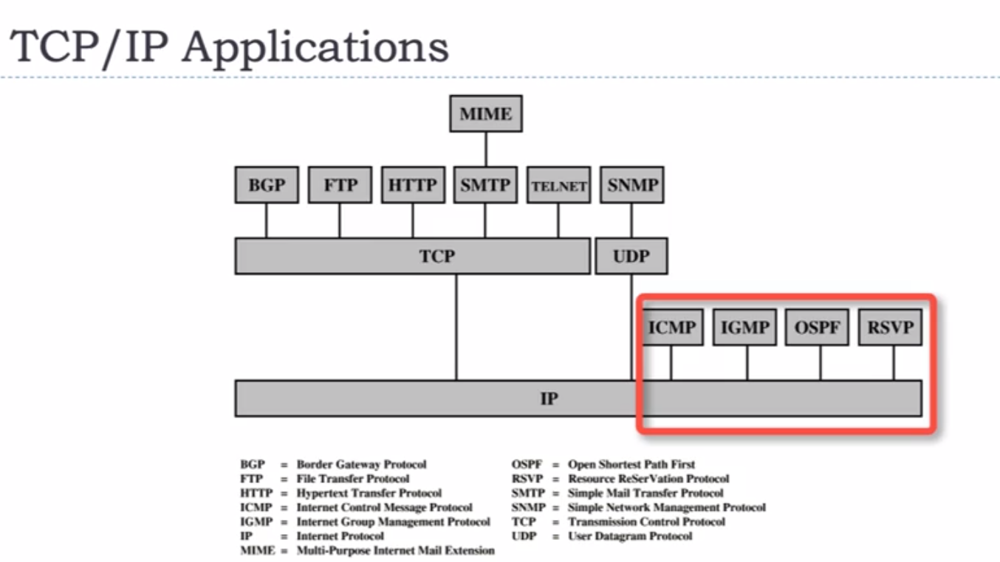
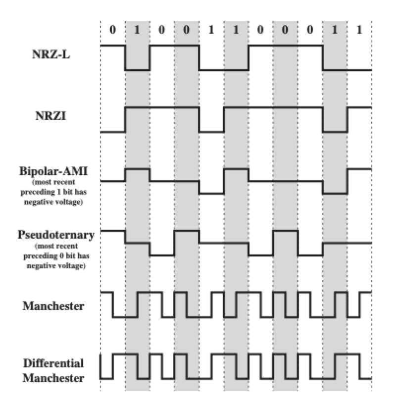

# CS 571 Computer Networks

- Case study topics
  - Cloud computer/mobile cloud computing
  - Cellular networks
  - IoT
  - Localization and location-based services
  - Mobile sensing and applications
  - Network security and privacy
  - Vehicular networks
  - WLAN, WPAN, RFID, NFC
  - Connected unmanned aerial/terrestial/underwater systems
  - AI Applications for Networking and IoT
- Case Study
  - Write proposal
  - Write literature review
    - IEEE paper format
  - Presentation for class
    - 10-15 mins
    - background might be explained?
    - topic should tie to Computer Networks

## Notes

- Computer Networks
  - collection of computers interconnected by single technology
    - exchange info
    - **Internet**
  - Connections
    - copper wire, fiber optics, microwaves, infrared, satellites
- Distributed System

  - Collection of computers appears as single coherent system
    - **World Wide Web**
  - Built on top of a network

- Network Uses

  - Business application -> **resource sharing (info)**
  - **Communication medium**
    - email
    - IP Telephone / Voice of IP (VoIP)
      - calls via network
    - **Desktop sharing**
  - **e-commerce**
    - business via electronically
  - Home Applications
    - **connectivity**
  - Entertainment
    - TV via IPTV (IP TeleVision)
  - Ubiquitous computing
    - power-line networks
    - Radio Frequency IDentification (RFID)
      - chips on cards and etc
  - Mobile Users
    - Wireless hotspots (802.11 standard)
      - fixed wireless vs mobile wireless

- **Client Server Model**
  - Network as middleman
  - Client on simple machiens
  - Servers are powerful computers
  - Client sends request, server sends back response/reply
- **Peer-to-peer (P2P)**
  - find nearby people to communicate with

### Broadcast/Point-to-Point Networks, PAN, LAN

- Communication model

  - Basic Model
    - Source, Transmission, Receiver
  - exchange of data between 2 parties

  1. Source (computers / telephones / etc)
     - produce data stream
  2. Transmitter
     - encode data -> signals
  3. Transmission System
  4. Receiver
     - decode signal -> data
  5. Destination

- Network Taxonomy (classifying networks by)

  - Types of Transmission Technology
    - broadcast networks
    - point-to-point networks
  - Scale (Distance)
    - LAN, MAN, WAN

- Point-to-Point link
  - connect individual pairs of machines
  - packets, routes
- Unicasting

  - point-to-point with exactly 1 sender and receiver

- Broadcast Networks

  - single communication channel shared by all machines on network
    - each machine receive same packet
      - address field defines recipient on packet
      - if not recipient, discard packet
  - Broadcasting
    - packet received and processed by every machine on network
    - can address packet to all destinations
  - Multicasting

    - packet transmitted to subset of machines

- q1: 1, 2, 3
- q2: source, transmission, destination

- LAN connects devices over the range of a person.

  - router
  - A network service provider is a subnet operator which is also known as ISP (Internet Service Provider).

- Scale (Distance)

  - interprocess distance
    - 1m (square meter) = personal area network (PAN)
    - 10m-1km (room, building, campus) = local area network (LAN)
    - 10km (city) = metropolitan area network (MAN)
    - 100km-1000km (country, continent) = Wide area network (WAN)
    - 10,000 km (planet) = internet

- Personal Area Network (PAN)
  - connect devices over range of a person
  - Bluetooth
    - Master-slave paradigm
      - PC is master
        - what addresses to use, when can broadcast, how long can transmit, freq
      - mouse, keyboard, headphones are slaves
- Local Area Network (LAN)
  - Wireless LAN (802.11 - WiFi)
    - Access point (wired to network)
      - relays packets
  - Switched LAN
    - various network segments are interconnected using switches
    - Ethernet
      - copper wire / optical fiber
      - Ethernet Switch
        - has multiple ports computer can connect wire into
        - at most 1 machine can successful transmit at a time
  - Enterprise networks
    - companies using LAN
- Wide Area Network (WAN)

  - ex: connect 3 branch offices
  - Subnet
    - collection of routers and communication lines owned by network operator
    - components
      - **transmission line**
        - moves bits
        - copper wire / optical wire / radio waves
        - usually leased from telecom company
      - **router**
        - 2 routers connected by transmission line
    - Internet Service Provider (ISP)
      - network service provider (NSP, also considered ISP)
        - connects networks
      - buy connectivity from ISP to use it
      - no shared transmission line, share indirectly via intermediary routers
        - use routing algorithm
  - VPN (Virtual Private Network)

    - virtual links run on top of internet
    - pros
      - flexible reuse of resource
    - cons
      - lack of control of underlying resource (varies by company)

  - Implementations
    - **Circuit Switching**
      - dedicated communication path
        - seq of physical links between nodes
          - logical channel on each link
            - data routed without delay
      - rapid transmission
        - fixed data rate
      - ex: telephone network
    - **Packet Switching**
      - send small chunks called packets
        - node to node, source to destinatino
      - usage
        - terminal-to-terminal computer, computer-to-computer communications
      - Lots of overhead to prevent errors
        - extra bits on packets to reduce redundancy and additional processing at nodes
    - **Frame Relay**
      - Take advantage of high data rates and low error rates
        - strip out overheadinvolved with error control
      - up to 2 Mbps
      - variable length packets called frames
    - **Asynchronous Transfer Mode (ATM) / Cell Relay**
      - circuit switching + packet switching
      - fixed-length packets called cells
        - 10-100s Mbps and in Gbps
      - allow multiple channels with data rate dynamically set on demand

- Metropolitan Area Network (MAN)

  - middle ground of LAN and WAN - centralized topology
    WAN connects devices over a country.

- Summation
  - Sum of Arithmetic Sequence (ex: n = 4, 0 + 1 + 2 + 3 + 4)
    
  - Sum of Proportional Sequence
    - 
- Binary Tree

  - Complete full binary Tree
    - height, h starts at 0 index
    - **total nodes, **
      - sum of proportional sequence, a = 2
    - given nodes, height, 
  - Balanced binary tree
    - Balanced if
      - left and right subtrees height differ by at most 1
      - left subtree is balanced and right subtree is balanced
        - check each subtree
    - Balanced full binary tree
      - **height, **
        - l is number of total leaves
        - number of nodes on Kth level = m <= 2^k
          - number of leaves = l <= 2^h
      - **Number of leaves In full binary tree**
        - 

## Basic Probability

- Event A is subset of S
- Probability is a function which associates A with number between 0 and 1
- measure change/likelihood A will happen
- Properties

  - P() is probability function, event A
    - P({}) = 0
    - P(A) <= 1
    - P(A') = 1 - P(A)
      - A' is complement of A
    - P(S) = 1
  - If outcomes S are equally likely
    - P(A) = #A / #S
      - #A is total elements in A

- Product Rule
  - job consisting of K seperate tasks
    - ith job can be done in ni ways for 1 = 1, ...k
    - job can be done in n1 x n2 ... nx nk ways
- Expectation / Expected Winnings
  
  - x are outcomes
  - p are probabilities
  - ex:
    - Roll die
      - 1, 2, 3 then you win $2
        - 3/6 chance for 2
      - 4, 5, 6 then you lose $1
        - 3/6 chance for -1
      - (.5 \* 2) + (.5 \* -1) = expected winnings
- Permutation
  - Choose k subjects out of n subjects **without replacement, order matters**
    
- Combination
  - Choose k subjects out of n subjects **without replacement, order does NOT matter**
    
- Binomial distribution

  - n, total number of independent experiments
  - p is discrete probaility distribution of number of successes in sequence of independent experiments
  - propability of p
    - failure: 1 - p
  - Bernoulli trial / experiment
    - single success/failure experiment
  - Bernoulli distribution
    - n = 1, k = 0 or 1
  - Equation
    
    - combination x success x failure

## Internet and Layer Design Issues

- internetworks / internet
  - collection of interconnected networks
  - generic sense
- Internet (Specific internet)

  - ISP networks to connect enterprise networks, home networks, and other networks
  - evolved from ARPANET
    - first operational packet network
    - developed to solve problem of communicating across arbitrary, multiple, packet-switched networks
    - Led to Foundation of TCP/IP protocol suite
  - Internet operations
    - data -> sequence of IP packets (diagram)
    - packet -> travel series of routers and networks
    - each router, receive packet, decide routing and forward packet

- Internet Architecture
  - Network Access Point (NAP)
    - ISP can connect with one another in peering arrangements
      - ex: gov to commercial (ISP to ISP)
  - Point of Presence (POP)
    - 2+ networks/communication devices build connection with each other
      - ex: local user connect with company network (ISP)
- Customer-premises Equipment (CPE)
  - communication equipment located onsite with the host
    - service and capacity
  - ex: DSL, cable modem, setlett
- Internet Example Configuration
  - IP backbone network at center
    - At periphery
      - edge routers / aggregate routers
      - provide connectivity to external network and user
  - Large enterprise network
    - ATM (Asynchronous Transfer Mode) WAN
    - router with firewall
  - Small/business
    - ethernet LAN configuration
    - router to the internet (DSL)
  - Mobile devices
    - through cellular network
- Protocol Architecutre
  - Need for protocol architecture
    - data exchange involve complex procedure
    - better if task broken into subtasks
    - subtask modules arranged in vertical stack
    - implement each module separately
      - layers shouldn't affect other layers
      - provide functions to perform communication for layers above
      - use functions provided by layers below
    - Peer layers communication with protocol
  - Key features of Protocol
    - set of rules that allow peer layers to communicate
    - components
      - syntax
        - forms of data blocks
      - semantics
        - control information and error handling
      - timing
        - speed matching and sequencing
- Network Software

  - No exact architecture / topology of internet
  - Network structured in layers
    - built upon layers below
    - reduce design complexity
  - Protocol Hierarchy
    - Layer n communication process
      - virtual communication
      - data and control to the next lower level
      - interface between each pair of adjacent layers
    - Peers
      - entities comprising the corresponding layers on different machiens
      - communicate using protocol to talk to each other
    - Physical medium
      - actual communication occurs
    - Network architecture
      - set of layers and protocols
      - hides detail implementation and specification of interfaces
    - Protocol stack
      - list of protocols (1 protocol per layer)
    - Lower protocol layers often implemented/embedded in hardware/firmware

- Layer Design Issues
  - Addressing
    - Network growth and evolution
    - Addressing
      - network layer
    - Considerations
      - Each layer have mecanism to idenify sender and receiver addresses
      - Rules for data transfer
        - single direction
          - simplex communication
        - bidirection but only one direction at a time
          - half duplex communication
        - bidirectional including both directions simultaneous
          - full duplex communication
  - Error Control
    - Reliability despite failures
    - Codes for error detection/correction
      - data link layer
    - Considerations
      - error detection
        - find and resend
      - error correction
        - recover info
      - Tradeoff?
        - need to redundant info
      - used at low layers
  - Flow Control
    - Reliability despite failures
    - Error/flow control
      - transport layer
    - Consideration
      - piecing messages together from receiver
      - accomodating for differnet message lengths
  - Multiplexing
    - Allocation of resources like bandwidth
    - Multiple access
      - medium access layer
    - Congestion control
      - network and transport layers
    - Consideration
      - multiplex/demultingplexing to share network dynamically
        - according short-term needs host
    - Situation
      - cost ineffective or impractice to set up individual connections for each pair of communiction press
  - Routing
    - reliability despite failures
    - routing around failures
      - network layer
- Relationships between services and protocols

  - adjacent layers in protocol architecture

    - Primitives
      - specify function to be performed
    - Parameters
      - use to pass data and control info

  - Primitive Types
    - Request
      - issue by service user to invoke service and pass params to specify request service
    - Indication
      - service provider
        - indicate procedure has been invoked and provide associated params
        - notify user of provider intiated action
    - Response
      - issued by service user to acknowledge or complete some procedure previously invoked by indication
    - Confirm
      - service provider to acknowledge or coplete procedure previously invoked by request
  - Confirmed Service
    - request, indication, response, confirm
  - Nonconfirmed service
    - request and indication

- Connection-Oriented vs Connectionless Services
  - Connection-oriented service
    - modeled after telephone system
    - user stablshes connection, uses connection, release connection
    - **connection prior to communication**
      - reliable
        - file trasnfer
        - movie download
  - Connectionless Service
    - modeled after postal system
    - each message carries full destination address and routed through intermediate inside the system independently
    - **messages handled separately**
      -example
      - spammers and junk email
- Services and Protocols
  - Service
    - set of operations/primitives that a layer provides to the layer above it
    - nothing about implementation
    - interface between two layers to provide service (**vertical**)
      - lower layer
        - service provider
      - upper layer
        - service user
  - Protocol
    - set of rules governing format and meaning of frames, packets, or messages exchanged by peer entites within layer
      - protocols to implement service definition
      - free to change protocols at will
      - service visible to users
      - service and protocol completely decoupled
    - layer talks to peer using protocol (**horizontal**)

## Reference Models

- Reference Models

  - describes layer in network architecture
  - models

    - OSI reference model

      - model is useful, but protocols are not
      - layers

        1. Application

           - provides functions needed by user

        2. Presentation

           - syntax and semantic of info transmitted, different representations

        3. Session
           - manage task dialogs, synchronization
        4. Transport

           - provide end-to-end delivery

        5. Network
           - sends packets over multiple links, determines how to send packets
        6. Data Link
           - sends frames of info
        7. Physical
           - send raw bit signals

    - TCP/IP reference model

      - model is not useful, but protocols are useful
      - layers

        1. Application

        - provides session and presentation functions

        2. Transport

        - provide end-to-end delivery

        3. Internet

        - deliver IP packets where they are supposed to go

        4. Link

        - interface bewteen host and transmission links

      - Protocols in each layer
        - Application
          - HTTP
          - SMTP (email)
          - RTP (real time mediums / voice / movies)
          - DNS
          - FTP
        - Transport
          - TCP
          - UDP
        - Internet
          - IP
          - ICMP
            - Internet control message protocol
            - error reporting
            - sends and creates messages router/service/host can't be reached for packets
            - any IP networked device can send/receive/possess ICMP messages
        - Link
          - DSL
          - SONET (synchronous data transmission)
          - 802.11 (wireless local network)
          - Ethernet

- Standardized Protocol Architectures
  - layer architecture
  - functions well defined
  - standards developed independently for each layer
  - boundaries well defined
    - changes in one layer won't affect layer in another
  - Lower layers concerned with more levels of detail
  - each layer provides services to higher layer
  - layer standards
    - service definition
      - functional description for internal use
      - what services are provided
        - not how
    - addressing
      - service access point (provides service to next higher layer)
    - protocol specification
      - precise syntax and semanics for interoperability
      - protocol elements
        - format of PDU (protocol data units)
        - semantics of all fields
        - allows sequence of PDU
- TCP/IP Protocol Architecture
  - result of protocol research and developed conducted on ARPANET
    - ARPANET, experimental packet-switched network
    - funded by Defense Advance Research Projects Agency (DARPA)
  - TCP/IP protocol suite
  - Protocol suite, comprises large collection of standardized protocols
  - Layers
    - Physical Layer
      - physical interface between comuter and network
      - concerned with
        - characteristics of transmission midium
        - signal levels
        - data rates
    - Data Link Layer / Network Access
      - exchange data between end system and attached network
      - concerned with
        - destination address provision
        - access to and routing data across network link between two attached systems
        - invoking specific services like priority
        - software depends on type of network used
      - allows layers above to ignore link specifics
    - Internet Layer (IP)
      - implemented in all end system and router
      - allow data to traverse multiple interconnected networks
      - provide communication between devices that are attached to diff networks
      - IP protocol to provide routing function
      - implemented in end systems and routers
        - routers connect two networks and relay data between them
    - Transport Layer (TCP)
      - host-to-host layer
        - only implemented in end systems
        - keep track of data to assure all are delivered reliably to appropriate application
      - common layer shared by all applications
      - provides reliable delivery of data
      - data exchanged reliably is requried
        - all data arrive at destination
        - in same order as sent
    - Application Layer
      - provude support for user applications
      - need separate module for each type of application
- Operation of TCP and IP

  - steps
    - process on Host A, send message to process on Host B
    - TCP -> msg -> IP with instructions to send it to host B
    - IP -> packet -> network access layer with instructions to send to router J
  - Addressing Requirements
    - each host on subnet needs unique network address
      - IP address
    - each application on host needs unique address within host
      - port
  - Data transmission
    - User data by application of byte styeam
    - TCP segment: TCP Header + data
    - IP datagram: IP header + TCP segment
    - Network-level packet/frame: Network header + IP datagram

- Transmission Control Protocol (TCP)

  - usual transport layer
  - TCP segment, basic protocol unit
  - Provides reliable connection for transfer of data
    - connection, temporary logical association btween two entities in different system
    - logical connection, given pair of port values
  - Tracks segments between entities for duration of each connection
    - to regulate flow of segments
    - to recover from lost/damaged segments
  - TCP Header

    - 20 octects, 1 octect = 8 bits
    - source port | destination port
    - flow control and error control
      - sequency number
      - acknowledgement number
      - window
    - checksum 16 bit to detect errors in TCP segment
    - Header length 4 bit
    - Reserved 3 bits
    - Flags, 9 1 bit flags

- User Datagram Protocol (UDP)

  - alternative of TCP
  - no guaranteed delivery
  - no preservation of sequence
  - no protection against duplication
  - Minimum overhead
    - enable procedure to send message to other procedure with minimum of protocol mechanism
  - connectionless
  - adds port addressing to IP
  - UDP header
    - Source port | Destination port
    - checksum, optiona

- IP Header (IPv4)

  - minimum of 20 octects
  - IP Datagram / packet
  - 32 bit source and destination address
  - header checksum
  - protocol
  - Id, flags, fragment offset
  - version, IPv4 = 4
  - IHL, size of header
  - DS, real time streaming
  - ECN, ene to end notification injection without dropping packets
  - total length, entire packet size in bytes including header and data

- IPv6

  - 1996, developed by IETF (Internet Engineering Task Force)
  - Functional enhancements of existing IP
  - accomodate higher speeds and mix of data streams
  - Driving force: need for more addresses
  - IPv6 includes 128-bit source and destination fields

- OSI vs TCP/IP
  - OSI (Open Systems Interconnection)
    - developed by ISO
    - 7 layers
    - theorectical system delivered too late
    - TCP/IP is fact standard
  - TCP/IP
    - key protocols were mature and well tested while similar OSI protocols were in development
    - OSI model is uncessarily complex

- Model used in thise course

  - based on TCP/IP model
  - Layers
    - Application
    - Transport
    - Network
    - Link
    - Physical

# Physical Layer

- communication in forms of electromagnetic waves

  - media types

    - guided media
      - twisted pair, coaxial cable, optical fiber
    - unguided media / wireless
      - propagation through air, vaccum, seawater

  - Types of Links
    - Direct link
      - transmission path between two devices
      - no intermedia devices
        - except for amplifier or repeaters used to increase signal strength
      - both guided and unguided media
    - Point-to-Point
      - direct link between devices
      - are only 2 devices sharing medium
    - Multi-point
      - more than 2 devices share same medium
  - Transmission directions
    - Simplex
      - signals transmitted in only one direction
      - one transmitter and receiver
      - ex: TV / Radio
    - Half duplex
      - both stations can transmit but at only one time
      - ex: walkie talkie
    - Full duplex
      - both stations may transmit simulatenously
      - medium carrys signals in btoh directions at the same time
      - ex: telephones

- Analog and Digital Signals
  - electromagnetic signals are function over time
  - Time, domain, X axis
    - Analog signal
      - signal intensity varies in smooth fashion over time
        - no breaks or discontinuity
    - Digital signal
      - signal intensity maintains a constant level for some period of time
        and then abruptly changes to another
        - discrete
    - Periodic signals
      - same signal pattern repeated over time
      - ex: sine wave, square wave
  - Sine wave
    - fundamental periodic signal
    - 3 parameters
      - Peak amplitude (A)
        - max value or strength of signal over time
        - usually in volts
      - Frequency (f)
        - Rate at which signal repeats
        - Heartz(Hz) / cycles per second
        - Period (T) is amount of time for one reptition
          - T = 1 / f
          - inversely proportional to frequency
        - Phase
          - relative position in time within a signal period of a signal
    - equation
      
    - Wavelength (lambda)
      - wavelength of a signal is distance occupied by a signle cycle
        - distance between two consecutive cycles
      - 
      - 
      - when v = c
        - c = 3x10^8 m/s (speed of light in free space)
    - Frequencies
      - signals made of many frequencies
      - components are sine waves
      - Fourier analysis shows that any signal is made up of components at various frequencies in which each component is a sinusoid
      - can plot frequency domain functions
- Spectrum and Bandwidth

  - spectrum of a signal
    - range of frequencies contained in signal
  - absolute bandwidth of signal
    - width of spectrum
      - ex: 3f - 1f = 2f
  - effective bandwidth / bandwidth
    - narrow band of frequencies containing most energy
  - Dc Component
    - component of zero frequency
  - given waveform may contain frequencies over very broad range
    - any **transmission system** has a limited band of frequencies
      - limits data rate that can be carried on transmission medium
  - Bandwidth is physical property of transmission medium
    - construction, sickness, and length of wire/fiber
  - 
  - Having less bandwidth (harmonics) degrades signal
    - more difficult to retrieve the information
    - 1 harmonic is the fundamentally frequency of original signal

- Fourier Analysis

  - Theorem
    
    - f0 = 1/T, fundamnetal frequency
       
      
       
      
       
      
  - Amplitude phase
    
     
    
     
    
     
    
  - For periodic signal, Average power in one signal
    
  - Distribution of power
    
    - integral of delta(f)dt = 1
    - delta(f) is unit impulse
      - if f = 0, infinity
      - if f != 0, 0
    - Cn is fuourier coefficients
  - periodic waveform, power through first j harmonics is
    
    - half-power bandwidth is interval between frequencies which S(f) has dropped to half of its max value of power, called: 3dB point
    - Numbers of harmonics passed
      - Bandwidth / (bit rate in bps / bit-data)

- Nyquist formula

  - Nyquist Sampling Theorem
    - frequency of signal is no higher than B Hz
      - a sufficient sample-rate is anything larger than 2B samples per second
    - Maximum possible data rate on communication channel
      - data rate - in bits per second (bps)
      - bandwidth - cycles per second or hertz
      - noise - on communication link
      - error rate - corrupted bits
    - Limitations due to physical properties
      - greater the bandwidth the greater the cost
    - High of data rate at particular limit of error rate at given bandwidth
      - main constraint: noise
    - low for 0, high for 1
    - Symbol: consists of signal bits or n bits
      - 2 symbols: 0 and 1
      - 4 symbols: 00, 01, 10, 11
      - **M = 2^n**
        - M - symbols
        - n - bits
    - in noise-free channel, rate of signal transmission is 2B then signal with frequencies nog reater than B
      - given bandwidth B, highest signal rate is 2B
    - In noise-free channel
      - **Max data rate = 2B log2 M bits/sec**
        - B is bandwidth in Hz
        - M is number of signal levels
  - ex 1

    - noiseless chanlle with bandwidth of 3000 Hz, transmit signal with two signal levels, what is max bit rate?

    - BitRate = 2 x 3000 x log2 2 = 6000 bps

  - ex 2
    - need to send 265 kbps over noisless channel with bandwidth of 20 kHz, how many signals?
    - 265000 = 2 x 20,000 log2 L
    - log2 L = 6.625
    - L = 2^6.625 = 98.7 since not an int, we need to **increase levels or reduce bit rate**
      - increase level: L = 2^7, bit rate = 2 x 20,000 log2 128 = 280kbps
      - decrease level: L = 2^6, 240 kbps
      - **choice in this case, reduce bit rate**

- Shannon Capacity Formula
  - relation
    - components
      - data rate
      - noise
      - error rate
    - burst of noise affects more bits
    - given noise level, higher rates = higher errors
  - Forumla
    
    - B = bandwidth (hz)
    - S = signal strength
    - N = noise
  - Capacity
    
  - theoreticla maximum capacity
  - get lower in practice
  - SNR, signal-to-noise ratio
    - decibels
    - SNRdb = 10Log10(S/N)
  - Ex
    - channel, 1-MHz bandwidth, SNR is 63
      - What is appropriate bit rate and signal level?
        - shannon formula to find upper-limit
          - 10^6 log2(1+63) = 6
        - Nyquist
          - 6 Mbps = 2x1MHzxlog2 L => 2^3
        - for better performance, choose lower bit rate
          - ex: 4 Mbps
  - Shannon capacity gives upper limit
  - Nyquist forumla tells us how many levels
    - tells use achievable max data rate
    - must use different signaling method to achieve Shannon's
- Analogy and Digital Data Transmission
  - continuous and discrete
  - 3 regards
    - data
      - entities that convey info
    - Signals
      - electric or electromagnetic representation of data
    - signaling
      - physical propagation of signal along suitable medium
    - transmission
      - communication of data by propgation and processing of signals
  - Analog Data
    - audio, accoustic soundwaves
    - humans can perceive it
    - human speech
      - 100hz to 7 kilo hz
      - 600-700 hz usually
      - 25db
    - limited frequency spectrum, continuous
  - Digital Data
    - binary data
    - terminals, computers
    - two DC components
      - 0 and 1
    - bandwidth depends on data rate
    - digital to modem to analog signal
      - encodes data
    - analog to codec to digital signal
      - decodes data
    - Pros and cons
      - cheaper
      - data integrity
        - less susceptible to noise
          - repeaters -> longer distance over lower quality lines
      - but greater attenuation
        - can lose info
- Transmission Impairments
  - Signal received may differ from transmitted
    - Analog, degradation of signal quality
    - Digital, bit errors
  - Most significant impairments
    - attenuation distortion
    - delay distortion
    - noise
  - Attenuation
    - strength of signal fall off with distance over any transmission medium
      - varies with frequency
      - higher frequency = greater attenuation
  - Delay Distoration
    - occur in transmission cable
      - twisted pair, coaxial cable, optic fiber
    - doesn't occur in air
      - antennas
    - Occurs because propgation speed of signal in guided medium varies with frequency
      - velocity tend to be highest at center, fall off at ends
        - arrive different times, varying delays
    - critical for digital data
      - part of one bit spill over into others
        - **intersymbol interference**
          - limitation to max bit rate
  - Noise
    - additional signal between transmitter and receiver
    - categories
      - thermal (predictable and constant magnitude)
        - thermal agitation of electrons
        - presented in all elecontric devices and medias
        - uniformly distributed across bandwidths
        - white noise
      - Intermodulation (predictable and constant magnitude)
        - by nonlinerarities in transmitter and receiver
        - effect to product signals at frequency that is sum or difference of two original frequencies
        - due to excessive signal strength / malfunction
      - Impulse noise (non continuous)
        - irregular pulse or spike
        - short duration
        - high amplitude
        - minor annoyance for analog signals
        - major source of error in digital data
        - lightning, etc
  - Succeesful transmission of data based on
    - quality of signal
    - transmission medium characteristics
  - Characteristic and quality determined by medium and signal
    - unguided media
      - bandwidth produced by antenna
    - guided media
      - medium
- Circuit Switching
  - uses dedicated path betweeen two stations.
  - three phases
    - establish
    - transfer
    - disconnect
  - inefficeint
    - channel capacity dedicated for duration of connection
    - if no data, capacity wasted
  - setup connection takes time
    - transfer is transparent after connected
  - telephone system
    - fully-interconnected network
      - all nodes connected with each other
    - centralized switch
      - simplicity
      - short hub, 1 node in center
      - security, maintability, upgradability
      - reliability, failure in center, entire network damaged
    - two-level hierarchy
      - combination of full-interconnected and centralized switch
      - star configuration
    - components
      - local loops
        - analog twisted pairs into houses and businesses
      - trunks
        - digital fiber optics connecting the switching offices
      - switching offices
        - pass calls from one trunk to another
      - local call procedure
        - direct connection made when subscribe attached to given end office calls another subscribe to the same end office
      - long distance calls
        - outside local loop
          - end office routes call to nearby toll office
        - caller and callee phone in same toll office
          - direct connection
        - caller and callee phone different toll offices
          - additional hierarchy required, intertoll trunk (interoffice-trunk)
    - Local loop
      - modem to convert digital to analog
      - codec to convert analog to digital
      - computer -> digital -> modem -> analog -> codec -> digital -> medium-bandwidth trunk -> toll office -> high-bandwidth trunk-> toll office
- SONET

  - protocol to transfer bit to bit string
  - sychnonous optical entwork
  - high speec capability of optical fiber
  - virtually all long-distance telephone use SONET in pyhsical layer
  - common signal standard
    - wavelength, timing, framing structure
    - possible for different carrier interwork
      - unify US, Euro, Japanese digital systems
    - can multiplex multiple digital channels

  # Packet Switching

  - circuit-switched
    - **for voice**
    - dedicated path established
      - fiber, copper, microwave
  - Packet-switched

    - **for data**
    - small packets
    - **consists of data and control info**
      - routing info
    - received, stored briefly, passed onto next node
    - typical upperbound, 1000 bytes

      - series of packets if larger

    - pros
      - line efficiency
        - single node-to-node link can be dynamically shared by many packets over time
        - packets are queued up and transmitted as possible over the link
      - Data rate conversion
        - two stations of diff data rate can exchange packets
          - can buffer data if require equalize data rates
      - Packets accepted even when network is busy
        - still accepted but delivery delay increases
      - Priorities can be used
    - Techniques
      - stations break long msg into packets
      - packets sent one at a time to network
      - packets handled in two ways
        - datagram
          - each packet is treated independently with no reference to previous packets
        - virtual circuit
          - preplanned route is established before any packets are sent

- datagram

  - **packets may not follow same route** despite same destination
    - depends on traffic, availability, etc
    - **may not be in order**
  - **Destination must reorder**
    - handle lost of packets
    - packet can be destroyed
      - crashed

- Virtual circuit diagram

  - route is fixed prior to data transfer
  - Node doesn't have to make routing decision for packet
    - only has to do it once

- Packet Size vs Transmission Time

  - T = (data length + header size) x (# of hops + (packets per msg - 1))
    - msg: 40B octects/bytes, 3B control info
    - X -> a -> b -> Y
      - entire msg: (40 + 3) x 3 = 129BT, 3B overhead
      - 2 messages: (20 + 3) x (3 + (2 - 1)) = 92BT, 6B overhead
      - 5 message: (8 + 3) x (3 + (5-1)) = 77BT, 15B overhead
    - **processing, queueing at each node, and overhead for more packets**

- Timing

  - Host -> Node1 -> node2 -> host2
  - Delays
    - propagation
      - signal propagate from one node to next
      - usually neglible
    - Transmission
      - transmitter send out block of data
    - Node
      - processing
  - Circuit

    - circuit establish
    - data transmission
    - circuit terminated
    - Total Delay = total transmission + total propgation + total processing

      - Linked prpagation delay = L
      - per-hop processing delay = P
      - transmission speed = W bit/s
      - message size = B bits
      - number of hops = M

      - Total transmission = B / W
      - total propgation = 4ML
        - link to host, return back link, send data, terminate link
      - total procesing = (M-1)P
      - B/W + 4ML + (M-1)P

  - Datagram

    - packet transmission delay = T
    - message contains N packets
    - total delay = total transmission + propagation + processing + store&forward
      - NT + ML + (M-1)P + (M-1)T

  - Virtual circuit packet switching
    - total delay
    - NT + (M-1)T + 4ML + 4(M-1)P
  - **interested in only delay elapsed from first bit sent to last bit was received**
    - circuit swithcing
      - delay= B/W + 3ML+ (M-1)P
    - datagram packet switching
      - delay = NT + ML + (M-1)T + (M-1)P
    - virtual circuit packet switching
      - delay = NT + 3ML + (M-1)T + 3(M-1)P

- Slow link vs Fast link
  - propgation bounded by speed of light
  - circuit switching
    - adds exrtra dountrip over packet switching
    - eliminates sotre and forward delays
  - Slow link
    - bottleneck is transmission speed
      - w/o store and forward helps a lot
      - extra roundtrip adds neglible delay
      - circuit switching
  - Fast link
    - bottleneck is propagation delay
      - adding roundtrip hurts
      - w/o store and forward saves neglible amount of time
      - packet switching

# Modem, Ecoding, Modulation

- Modem

  - input: accepts serial stream of bits
  - produces: modulated carrier and vice versa
    - twisted pair, cable, optical fiber, wireless
  - AC signaling used
  - sine wave carrier

- Signal Encoding Techniques

  - digital signaliing g(t) encoded (encoder) into digital signal x(t)

    - x(t) depends on encoding technique and optiimze transmission medium

  - Modulator
    - Carrier frequency
      - continuous constant-freq signal
        - basis for analog signaliing
      - data transmitted using carrier signal by modulation
        - Modulation
          - process of encoding source data into carrier signal with freq Fc
          - all modulation techniques
            - involve one or more
              - amplitude, frequency, phase
          - Input signal m(t), modulating signal / baseband signal
            - digital or analogy
          - output: modulated signal s(t)
            - s(t) is bandlimited (bandpass) signal
          - location of bandwidth on spectrum is related to fc, often near center
          - actual encoding, chosen to optimize characteristic of transmission

# Digital Data vs Digital Signal

- Digital Signal
  - seq of discrete, discontinuous voltage pulses
  - each pulse is a signal element
  - binary data transmitted, each bit into signal element
- Terminology
  - unipolar
    - all signal elements have same sign
  - polar
    - one logic state represented by positive and negative voltage
  - Data rate
    - rate of data, bits per sec (bps)
  - Duration or lenght of bit
    - time taken for transmitter to emit for the bit
  - Modulation rate
    - rate at whcih signal level is changed
    - rate expressed in baud, signal elements per second
  - Mark and Space
    - binary digits: 1 and 0 respectively

# Key Data Transmission Terms

- Data Element
  - Bits
  - signla binary, 0 or 1
- Data Rate
  - bits per sec (bps)
- Signal element
  - digital: voltage pulse of constant amplitude
  - analog: constant freq, phase, and amplitude
  - part of signal that occupies shortest interval of signaling code
- Sigal rate / modulation rate
  - signal elements per second (baud)
  - rate of signal elements transmitted

# Encoding Schemes

- Nonreturn to Zero-Levle (NRZ-L)
  - 0 = high, 1 = low
- Nonreturn to Zero Inverted (NRZI)
  - 0 = no transition at beginning of interval (one bit time)
  - 1 = transition at beginning of interval
- Bipolar-AMI
  - 0 = no line signal
  - 1 = postiive or negative, alternative for successive ones
- Pseudoternary
  - 0 = positive or negative level, alternative successive zeros
  - 1 = no line signal
- Manchester
  - 0 = transition high to lower, in middle of interval
  - 1 = transition from low to high, in middle of interval
- Differential Manchester
  - always transition in middle of interval
  - 0 = transition at beginning of interval
  - 1 = no transition at beginning of interval
- B8ZS
  - same as bipolar AMI, except any string of 8 zeros is replaced by a string of two code violations
- HDB3
  - same as bipolar AMI, except any string of four zeros if replaced by one code violation

- sequence: 01001100011
