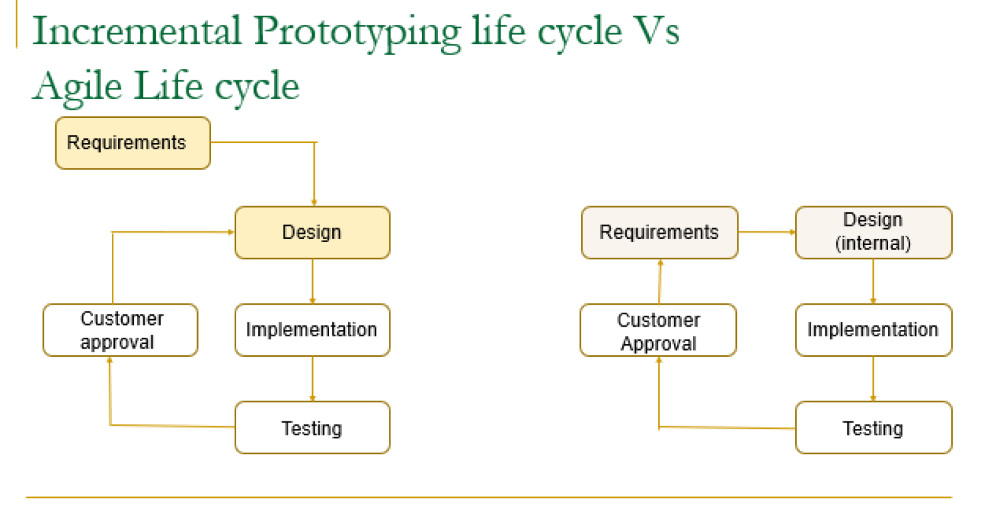
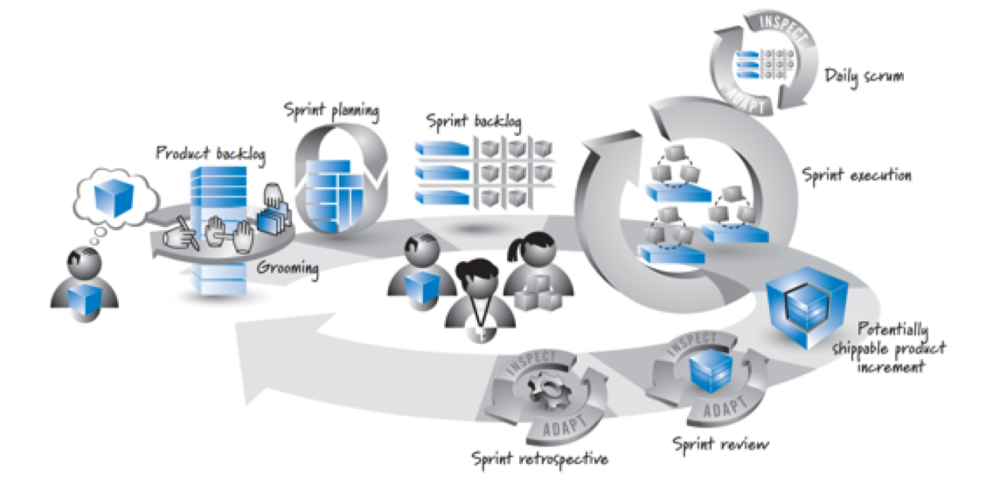
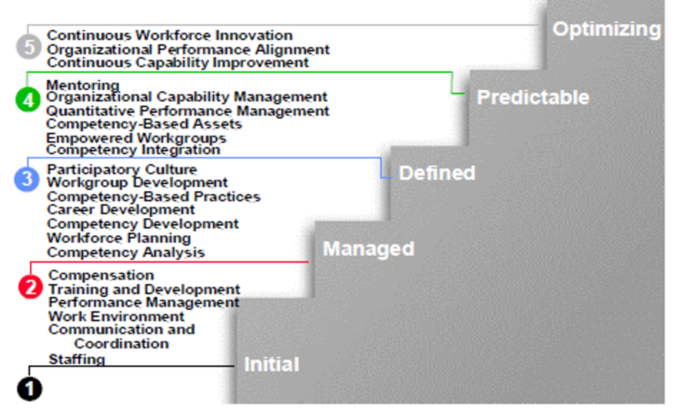

# CS 744 Notes Software Project Managmement
## Agile Development
### Focuses (agile manifesto)
- coding, testing
- early releases (usable products)
- customer interaction
- adaptive to changes
- quality

### Prototyping life cycle vs Agile life cyle 

-  Right side is agile, **reqs can change**

### Examples (not important)
- extreme programming (XP)
- Feature driven development (FDD)
- Dynamic Systems DEvelopment Method (DSDM)
- Lean Software Development 
- Kanban method
- Scrum

### Scrum Life Cycle 
- Keny Schwaber 1995
- deliverables during planning & sprint phases can be changed at any time

- Product Owner 
    - **creates reqs & maintain priority of reqs (product backlog)**
    - approves shippable product (acceptance criteria)
    - sprint planning, review, respective activities
    - Managerial responsibility
        - decision maker for funding 
        - ensure quality
    - knowledge of appl domain and vision of end product
    - **acts as the stakeholders** 
- Scrum Master (product/prj manager, but any other person could be)
    - coordinate all activites, coordinator
    - resolve conflicts
    - ensure principles followed

- Dev Team
    - experts, small (5-9)
    - scrum master provides technical assistance
    - sprint planning and prioritizing
    - goals, sprints, design, impl, integrate, test product
    - grooming backlog (revising and re-prioritizing)
    - self-organize, highly talented (T-shaped, use specialty, but try to help others)
    - good communication, focus on task

- Product Backlog  (list of PBI's)
    - PBI include: features, changes, defect to be impl 
    - user stories form (As a .., I want so.. )
    - **prioritized**
    - categorizable, can revise
    - size of PBI (item)
        - time to complete or # features 
    - Grooming
        - create, refine, estimate, reorder PBI's
    
- Sprint
    - cycle of seq activities (planning, exe, review, retrospective)
    - fixed start and end dates (short, week - month)
    - no goal altering changes in scope, exceptions
    - shippable product delivered

- Sprint planning 
    - recurring, just-in-time at beg of each sprint
    - backlog item -> set of est tasks

- Sprint backlog
    - set of tasks impl product backlog items
    - **sprint backlog = "how impl", product backlog = "what to impl"**

- Cost Estimation
    - complex and rarely accurate
    - sprint task cost est based on programmers ability, current task, and available resources
        - time-boxed with fixed durations
        - **cost** is using estimated time for each sprint task
        
- Sprint Planning
    - product owner approve PBI's
    - scrum msater ensure resources avail
        - PBI can be impl within current spinrt too
    - dev team: designs, impl, tsts, integrate
        - acceptance tests and test cases

- Factors for estimated Tasks
    - complexity of PBI
    - team size
    - team capacity (skill/time)
    - available resources
    - business/technical constraints

- Sprint execution
    - impl and testing
    - dev team picks: work flow, tools & libs, internal test cases, design artifacts
    - Factors
        - accelerated programming: tools, libs, pair programming
        - code refactoring
            - refactor code should be small
            - comments & additional documentation
            - sketches/design diagrams
        - automated testing 
        - version control & code repos
        - time control (inteneral deadline diff)
    - Shippable product
        - complete but not yet integrated with rest, passed all tests

- Daily Scrum Meeting
    - product owner, scrum master, dev team
    - presents accomplished prev day and whats to be done
    - resolve conflicts

- No goal-altering changes during a sprint
    - change: modification in work/resources that has serious economical conseq
    - clarification: adding more details that support
    - exceptions
        - competitive product launched, emergency work, unavoidbale loss of business support
- abnormal sprint termination
    - exception scenarios, keep next sprint within same time-box, remove/reintroduce into bcaklog, record termination

- Sprint review
    - acceptance with shippable product
    - record feedback and update backlog

- SPrint retrospective
    - discuss issues 
    - realign backlog

### Buzzwords
- Velocity 
    - eval & improve use of scrum
    - amt work in each sprint 
        - PBIs / tasks / importance 
    - Ex: 200 PBI before release, 10 sprints -> 20 PBI / sprint
        - usually do a range

- Technical Debt
    - incr cost of working on app with "not quite right" code
        - poor design / unnoticed defects / unsuff test coverage / poor integration & release / lack exp,tool,tech
    - Unavoidable technical debt
        - risk-based, third-party software integrated
    - Strategic tech debt
        - tools to monitor and pay back tech debt 
    - Managing accrual of tech debt
        - good practices, well-define goal, monitor debt & consequences
    - make debt visible to business & tech people 
    - payback debt incrementally
        - end of each sprint / n sprint / threshold 
- Task board
    - PBI | Task to do | tasks in progress | tasks complete

- Sprint burndown chart  (downward slope)
    - X axis: days within a sprint
    - Y axis: est effort-hours remaining 

-  Sprint burnup chart (upward slope)
    - X axis: days within sprint
    - Y axis: story points

### Role of Project Manager
- responsible for outcome, coordinate activties, knowledge of all phases, communicate with every single team member
- build & maintain group, set reasonable goals, measure progress, eval performance, motivate members, prov adequate facilities and resources for project

#### Characteristics 
- polite, patient, friendly, honest, courteous
- understand and listen
- knowledge of all tech areas 
- knowledge of app domain
- comm skills
- critical thinker, analyzer, coordinator

### Conflict Management
- Inevitable in group prj
- due to
    - scarce resources 
    - pressure (priorities/deadline)
    - personality issues
- if mng properly -> diff of opinion -> incr productivity and better dec making
    - else decr productivity
- deal with conflicts immed
    - importance and intensity
    - time pressure 
    - relative power of people involved 
    - motivation to resolve (short & long-term)
- **conflict management techniques**
    - **Widthdraw / Avoid conflicts**
        - 1+ people in conflict due to **personality** -> give up 
            - both equal -> try to convince one to withdraw
            
             Two people argue on choosing Java or C# as the development language. Project manager finds both languages and their associated tools are equally capable in completing the project. So, the project manager convinces one of them to withdraw.

            Two subgroups argue on choosing two different locations as the next meeting venue. Both locations are easily accessible and have all the resources necessary for the meeting. So, the project manager convinces one of the groups to withdraw

        
    - **Smooth / accommodate**
        - whats is done best by bother parties, emphasize areas agreement before differences
        - smooth argu and maintain harmony & relationships

        Two parties argue about a particular error popping up in the code blaming each other. Project manager explains how both parties worked well in the past, with no such errors; explains how these types of errors can be avoided or traced back; explains how one helps the other when there is a problem in coding

        Two parties argue on scheduling issues and try to choose their own schedule. Project manager explains the time pressure on completing the project; explains how they both did well in the past in completing the tasks on time.

    - **Compromise / Reconcile** 
        - solution -> degree satisfaction to all parties involved -> temporary/partially resolve conflict
        - lose-lose, use other techniques first 

        Two parties argue that the overall productivity decreased because of the incompetency of the other party (not sufficiently skilled, lazy, did not care for the project, …). Project manager finds that both parties are not doing what they are supposed to do. So, project manager takes a firm decision by himself on work allocation, time schedule and completion of tasks, and enforces them on both parties

    - **Force or direct or dictate**
        - win-lose 
        - justify decision: time/budget 

        Two parties argue that the project’s priority by upper management was lowered (and so project does not get enough funding) because of mistakes made by the other party. Project manager carefully analyzed the situation and found that there are more mistakes made by one party, say A, than the other and hence forces A to correct the mistakes.

        Two parties argue on who will demonstrate the final product to the marketing team. The project manager evaluated the presentation skills by both parties and gives a chance by one who did well in presentations in the past.

    - **Collaborate/Solve the problem**
        - study carefully, identify all srcs for origin of conflict, multiple viewpoints and insights, req transparency, open dialogue, cooperative attitude
        - win-win

        Two parties argue on using two different sets of libraries to improve the GUI. Project manager studies the two support provided by both libraries, ease of training for those who are not familiar with those libraries, steps necessary to adapt them with the product and so on, and then chooses the best among the two. He/she then explains the reasons to both parties.

### SPeople Capability Maturity Model (P-CMM)
- P-CMM roadmap -> continuously improv capability of org workforce
- practice performance decay if no P-CMM
- improvements
    - repeatable practices
    - competency based practices
    - measure and empowered practices
    - continuously improving practices
- 5 Levels
    - 1, intial maturity level
        - no proper mgmt practices enforced
        - ad hoc, inconsistent mgmt practices
        - diff to retain talented individuals
    - 2, managed maturity level
        - mgmt practices at unit lvl
        - perf of units, may not be consistent with org practices
        - unit level, foundation for upper levels
    - 3, defined level 
        - org-wide infrastructure, add practices to units
        - capability of workforce to strategic business objs
        - dev competencies -> combined -> accomplish business objectives
    - 4, predictable level
        - mng & exploit capability 
        - mentoring, quanitative evals, trust and delgate work
        - predict future capability 
    - 5, optimizing level
        - continual improvement, improv individ & group work
        - supports cultural of performance excellence
            - award talents and achievements
- Competencies
    - core, workforce, individual: knowledge/skills/prcoess abilities
        - workforce
            - knowledge + skills + process abilities (capacity to perf individual skills in method used in org)
- P-CMM Process Areas
    - each maturity level has related practicies to achieve goals 
    - 

### Software Quality Management
- ISO/IEC 9126-1 def
    - Functionality
        - functions that satisfy needs
    - Reliability
        - capability to maintain level of perf under stated conditions for stated period of time
    - Usability
        - effort needed for use
    - Efficiency 
        - level of perf and amt resrcs used
    - Maintainability 
        - make specified modifications
    - Portability
        - transferred from 1 environment to another

- Classification of software quality
    - product quality
        - quality of end product
    - process quality
        - process involved in dev product
        - correct processes followed & outcome expected
    - customer expected qualities
        - efficiency, reliability
    - dev expected qualities
        - maintainability, reusability

- Management Acitvities
    - quality assurance
        - procedures & standards for quality
    - quality planning
        - procedures & standards for org
    - quality control
        - measure quality & maintain them
- Procedures and standards
    - prevetion over inspection
    - org > individual projects  (cheaper)

- Software quality standards
    - guard against not repeating prev mistakes
    - avaiable extensive documentation -> easy to train

- Quality Management Processes
    - define quality, plan activities to achieve quality, eval quality & monitor control processes
- ISO 9000, ISO 9001 (product quality)
    - audits
- Six Sigma
    - cust focused business improvment process
    - defect reduction
    - measurement: Sigma capatability / Z
        - 6 sigma capatability = 99.9996% efficiency
        - uses standard deviation (sigma)
            - X is sigma
            - Y is defects found 
    - Application
        - 1) Collect data relevant to problem
        - 2) calculate 
            - mean 
            - standard deviation
            - methods for medians and deviations
        - 3) Six Sigma analysis
            - LSL (lower sepc limit) 
            - HSL (higher spec limit)
    - Software Dev Usage
        - collect # defects per million lines of code
        - bell curve
        - quality model (3sig / 6sig)
        - minimize defect to maintain product at chosen quality level
    - Support for productivity
- DMAIC Methodology
    - define
        - factors/parameters to be considered
    - measurement 
        - factors/parameters to be measured 
            - how will be measured 
            - additional things needed  (ex: time frame, number of X, etc)
    - Analysis
        - mechanism to carry out measurements and which to be improved first (prioritizing based on measurement)
            - ex: records of timings
    - Improvement 
        - high-priority factors to be improved 
    - Control 
        - improvement mechanisms properly employed & maintained

### Risk Management 
-  action/event may/may not occur
    - if occur, harmful effect 
    - definite uncertainity in occurence of risk
    - if handle risks, plan well ahead  
- Risk (prebabalistic event)
    - 0.1 - 0.9 probability of occurrence 
    - examples
        - incompatibility with external tools
        - unexpected reduction in staff during dev
        - sys crash due to hardware 
        - not completed due to shedule changes   
- Risk categories
    - schedule
        - memeber quits 
        - memeber reassigned
        - budget cut
        - resource unavail
        - scope extended unexpectedly
    - technical
        - changing reqs
        - design errors
        - failure of tool used in dev
    - operational
        - fail to prioritize functionalities
        - inadequate training
    - Business 
        - market slip
        - doesn't fit business strategy
        - marketing not trained to sell
        - change management, not support
        - change org structure, staff/budget re-allocation
        - unrealistic delivery date
- Handle risks even with additional cost
    - minimize negative impact of risks
    - focus on unique threats to spec project 
- Risk Management
    - Risk Assessment
        - identification
            - identified by 
                - look at events in prev projects
                - what if's
                - some are evident
                - look at diff sources 
            - Risk Categorization
                - req, design, programming, schedule, cost levels
        - analysis
            - probability of occurrence of each risk 
                - prob(r)
            - cost of consequence of each risk  
                - loss(r)
            - risk exposure factor of each risk 
                - re(r) = RiskFunction (prob(r), loss(r))
        - prioritization
            - risk exposure val, loss, probability of occurrence, category
            - only risks within budget limit for consideration
                - top X risks 
            - may decide based on past exp / other factors
    - Risk Control
        - management plan
            - top X risks, design solutions to solve risk problems
                - additional resources
                - cost analysis
                - intermediate checking of risk factors (monitoring / tracking)
                - re-eval
                - record activities
                - suggested plans
                    - extra project time (10-20%)
                    - extra resources
                    - training any time
                    - rotate teams with diff tasks
                    - perform simulations & analyze solutions
                    - additional testing & review sessions
                - Example
                    - Risk | Prob | Loss | Exposure | Plan
        - resolution
        - monitoring
            - risks might not be risks anymore
            - continuously monitored
                - reass risk exposure
            - record all info for future use
- Scrum Risk Management
    - identification
        - planning/review/retrospective
        - while adding product backlog items
    - analyze
        - planning / retrospective
    - prioritziing
        - sprint / grooming
    - planning
        - planning / grooming
    - mitigation
        - execution
    - monitoring & control
        - outside of sprint

### Technical Writing
- 5 steps
    - preparation
        - purpose(s), scope, audience background, formal structure, timeline
    - research
        - solid info, reliable sources, write notes while gather info
    - organization
        - type of report
        - outline 
            - eval & modify outline
            - discuss with peers/advisers
            - compare with other reports
            - formal structure & scope to determine size
    - writing
        - elaborate contents from outline
        - materials from research 
        - apprpriate writing style
        - no spelling & grammatical mistakes
        - tables cautiously 
            - don't overuse
            - use figures when necessary instead of explaining
            - visible & readable
            - fit within margins
            - avoid colors if possible
            - captions & figures 
        - use references
            - only valid, reliable, accessible sources 
            - avoid websites, unstable
            - bibliography vs references    
        - acknowledge sources of info if include material from any source
    - revision
        - needs revision
        - 

